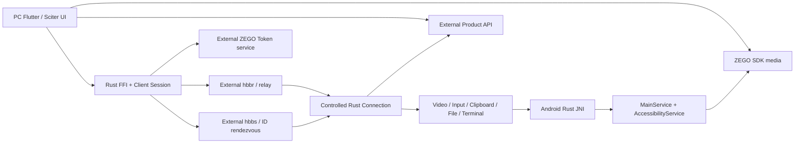

# CloudSend 完整架构 / Architecture

基线：2026-07-12，`HEAD 77062b4`

## 1. 运行体与信任边界

必须分开的信任域：

- 控制端（`controller`）：发起连接、解码画面、产生输入和文件操作。
- 受控端（`controlled endpoint`）：认证会话并执行高权限本地操作。
- rendezvous/relay：仓外基础设施；只在协议客户端中有定义。
- 产品 API：账号、地址簿、设备组、策略和 sync；后端不在仓库。
- ZEGO：Token service 与 ZEGO RTC 是两个外部域。
- Android OS：`MediaProjection`、Accessibility、overlay、ADB、前台服务分别由系统授权。
- Windows OS：driver、service、injection、privacy window 和 input hook 是本机高权限边界。

## 2. 分层架构

| 层 | 主要目录 | 职责 |
|---|---|---|
| Product UI | `flutter/lib/`, `src/ui/` | 桌面/移动/web UI、多窗口、遗留 Sciter |
| State/Bridge | `flutter/lib/models/`, `src/flutter*.rs`, `src/ui_*_interface.rs` | session/model、事件流、FFI、texture/RGBA |
| Controller | `src/client.rs`, `src/client/` | rendezvous、relay、登录、解码、文件/终端/输入发送 |
| Controlled endpoint | `src/server.rs`, `src/server/` | 认证、服务订阅、输入/文件/终端/视频执行 |
| Shared protocol | `libs/hbb_common/` | protobuf、config、socket/stream、crypto、fs |
| Capture/Input | `libs/scrap/`, `libs/enigo/`, `libs/clipboard/` | 采集、编码辅助、输入、剪贴板 |
| Native platform | `src/platform/`, `src/privacy_mode*`, Android Kotlin | OS service、driver、JNI、MediaProjection、Accessibility |
| Product integration | `src/hbbs_http/`, Flutter API models | OIDC、login、address book、group、sync、download |
| Packaging | `build*`, `env.sh`, `flutter/*`, `res/`, `.github/workflows/` | 生成、编译、签名、portable、平台发布 |

## 3. 控制面与数据面

### 3.1 控制面

- rendezvous registration、ID/PK、relay request：`rendezvous.proto`。
- session login、permission、display switch、privacy、terminal、ZEGO invitation：`message.proto`。
- Flutter/Android 状态同步：Rust event stream、MethodChannel、`cloudsend_status`。
- 产品策略：`hbbs_http::sync` heartbeat/config/disconnect。

### 3.2 数据面

- 视频：capture → codec → `VideoFrame` → relay stream → decoder → texture/RGBA。
- 音频：普通远控音频仍走 RustDesk `AudioFrame`；当前 1v1 语音走 ZEGO SDK。
- 输入：Flutter → Rust message → endpoint `input_service` → OS/Accessibility。
- 文件：`FileAction`/`FileResponse` + `TransferJob` block/digest/compression。
- 终端：`TerminalAction`/`TerminalResponse` + PTY service。
- Android raw frame：Kotlin direct buffer → JNI `FrameRaw` → Rust video service。

## 4. 会话架构

### 4.1 Controller

`LoginConfigHandler` 持有 peer、connection type、password/options、codec 和 relay 状态；`Client` 完成 rendezvous 与 stream 建立；`client/io_loop.rs` 是消息主循环；`FlutterSession` 将事件送到 Dart。

CloudSend controller 固定 `force_relay = true`，拒绝显式 direct address，并跳过 direct candidate。这个决定只证明 CloudSend controller 的默认路径；`rendezvous_mediator.rs::handle_punch_hole()` 在 controlled endpoint 仍可响应未设置 `force_relay` 的兼容请求。

### 4.2 Controlled endpoint

`RendezvousMediator::start_all()` 建立本机 server、注册 ID/PK、启动 sync，并保留 direct/LAN/NAT 继承逻辑。`Server` 注册服务；每个 `Connection` 完成登录、权限和消息分发。

远控会话认证与 `src/common.rs::verify_login()` 不同。后者当前直接返回 `true`，主要属于 legacy/custom-client UI 校验；受控端实际认证仍在 `src/server/connection.rs` 与 `hbb_common::password_security`。

## 5. UI 与状态管理

Flutter 使用混合状态方案：

- `provider` 承担主 session/model 注入。
- GetX `.obs`/`Rx*` 用于地址簿、设备组和局部响应式状态。
- 大量全局 singleton/registry 位于 `common.dart`、`model.dart`、`server_model.dart`。
- desktop 使用 `desktop_multi_window`，remote/file/terminal/port-forward 等窗口拥有独立 Flutter engine；plugin 注册必须在每个 runner/engine 完整执行。

此混合模型可运行，但状态所有权分散，容易产生 timer、stale client、dialog overlay 和跨 engine 生命周期问题。

## 6. Android 四层状态架构

Android 不能用一个“服务开关”描述：

1. core service/JNI：`_isReady`、`MAIN_SERVICE_CTX`。
2. screen share：`_isStart`、`mediaProjection`、`captureStarting`。
3. frame source：normal `ImageReader`、`SKL`、`shouldRun` ignore、one-shot。
4. PC display：`waitForFirstImage`、`waitForImageTimer`、last frame/reconnect。

core service 在线不等于投屏；projection 丢失不等于 relay 断开；只有真实 RGBA/texture frame 到 UI 才能清 waiting。详见 `04_ANDROID_PIPELINE.md`。

## 7. Windows 架构

- capture：DXGI 优先、GDI fallback，privacy 可切 Magnifier。
- input：`src/server/input_service.rs` → `libs/enigo/` / `SendInput`，portable service 可代理高权限操作。
- privacy：exclude/topmost window、Magnifier、virtual display 三类实现。
- virtual display：当前活跃选择为 Amyuni `usbmmidd_v2`，实际 platform addition 是 `amyuni_virtual_displays`；`cloudsend_virtual_displays` 只属于未选用 RustDesk IDD 分支。
- helper/injection：`RuntimeBroker_cloudsend.exe`、`WindowInjection.dll`、low-level hooks。

详见 `05_WINDOWS_PIPELINE.md`。

## 8. 仓外 API 架构

Flutter 普通产品登录和资源 API多为 Dart 直接 HTTP；Rust `account.rs` 主要提供 OIDC device auth；`sync.rs` 提供 endpoint heartbeat/strategy；`downloader.rs` 提供下载；`record_upload` 休眠。仓库没有后端数据库实现。

详见 `07_API_SYSTEM.md`。

## 9. 架构不变量

- 源码与运行时状态必须分层，不用 UI 文案代替真实状态。
- Android hidden recovery 不得弹 `MediaProjection` 授权。
- Android disconnect 不得自动停止 screen share。
- waiting 不得自动切 ignore/screenshot fallback。
- ZEGO 不得进入旧 `audio_service` 媒体链。
- ADB/LADB 不得污染 screen share/video/side-button 状态。
- controller relay-only 与 endpoint direct surface 必须明确区分。
- 任何 protobuf 改动必须同步 sender、receiver、FFI/UI 和兼容策略。
- Windows privacy/virtual-display 修改必须带 driver/OS/permission 恢复方案。
- secret 不得写入客户端、跟踪文档或脚本默认值。

## 10. 架构债务

- 根历史被压成单次导入，缺少可重放 upstream strategy。
- 大型 God files 与 global/static state 形成高耦合。
- Android raw buffer 和 `static mut` 横跨语言/线程安全边界。
- transport crypto、HTTP 与 fail-open 行为缺少正式 threat model。
- active/dormant/legacy feature 没有自动可达性检查。
- 构建和二进制资产依赖本机隐式状态。
- 手动-only Actions、少量测试和弱 commit 语义使回归证据不足。
