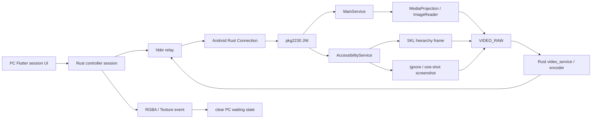

# CloudSend Android 完整链路 / Android Pipeline

基线：2026-07-12，`HEAD 77062b4`

> 本文只记录当前仓库可证明的 Android 运行时事实。标签含义：`verified` 为源码直接证实；`inferred` 为跨文件静态推断；`external` 为 Android/第三方平台行为；`verification-required` 为必须在正式构建机或真机确认的事项。源码高于本文。

## 1. 维护范围与入口

Android 不是“Flutter 应用加一个 Service”，而是四层共同组成：

1. Flutter 页面、session model 与 PC 侧控制 UI。
2. Flutter Rust Bridge、手工 C FFI 与 Android MethodChannel。
3. Rust client/server/protocol、`scrap` raw frame 与 JNI。
4. Kotlin `MainService`、`AccessibilityService`、`MediaProjection`、overlay、ADB 和 ZEGO SDK。

主要源码：

| 层 | 主入口 |
|---|---|
| Flutter 启动/主页 | `flutter/lib/main.dart`，`flutter/lib/mobile/pages/home_page.dart` |
| Flutter session/waiting | `flutter/lib/models/model.dart` |
| Flutter Android server state | `flutter/lib/models/server_model.dart` |
| Flutter input/side commands | `flutter/lib/models/input_model.dart`，`flutter/lib/common/widgets/overlay.dart` |
| Flutter native bridge | `flutter/lib/models/native_model.dart`，`src/flutter_ffi.rs` |
| Activity/MethodChannel | `oFtTiPzsqzBHGigp.kt` |
| MediaProjection permission | `XerQvgpGBzr8FDFr.kt` |
| MainService | `DFm8Y8iMScvB2YDw.kt` |
| Accessibility/Input | `nZW99cdXQ0COhB2o.kt` |
| Bitmap/frame helper | `EqljohYazB0qrhnj.kt` |
| Android JNI | `libs/scrap/src/android/pkg2230.rs` |
| ADB/LADB | `flutter/lib/mobile/pages/adb_page.dart`，`flutter/android/app/src/main/kotlin/com/cloudsend/app/adb/*.kt` |
| ZEGO | `flutter/lib/models/zego_voice_call_model.dart`，`flutter/lib/models/server_model.dart`，`src/client/helper.rs` |

当前移动主页只直接装载 `ServerPage` 与 `AdbPage`。Remote、file、terminal、camera、settings 等移动页面仍有源码，但不是当前主页的直接导航入口。

## 2. 总体链路



Android 端 core service、screen share、frame source 和 PC waiting 是四个不同状态域。任何维护工作必须先确认问题属于哪一层。

## 3. 四层状态模型

| 状态层 | 关键状态 | “已就绪”的真实含义 | 不能据此推断 |
|---|---|---|---|
| L1 Core service/JNI | `MainService._isReady`、`ctx`、`MAIN_SERVICE_CTX` | MainService/JNI/Rust core 可工作 | 已获投屏权限、已有首帧 |
| L2 Screen share | `_isStart`、`mediaProjection`、`captureStarting`、`surface`、`virtualDisplay` | normal MediaProjection 链已启动或正在启动 | PC 已显示画面、ignore/SKL 状态 |
| L3 Frame source | normal、`SKL`、`shouldRun`、one-shot | 当前向 `VIDEO_RAW` 提供数据的来源 | relay 状态、PC waiting |
| L4 PC display | `waitForFirstImage`、`waitForImageTimer`、last frame | 控制端是否收到真实 RGBA/Texture | Android service 或 projection 是否存活 |

附加状态也必须分开：

- `ServerModel._connectStatus` 直接来自 Rust `mainGetConnectStatus()`，代表真实 rendezvous 注册状态，不是 core service 存活证明。
- `ServerModel._coreServiceStarted` 与 `ServerModel._isStart` 分别表示 core 和 screen share。
- `CloudSendStatusModel` 显示 Android 状态快照；超过 8 秒无更新时字段清回 unknown，不伪造 ready/failure。
- 源码中 `_isReady // media permission ready status` 的注释已经过时；当前语义是 core ready。

### 3.1 必须保持的不变量

1. Core service 在线不等于 screen share 在线。
2. Screen share 在线不等于 PC 已收到首帧。
3. Projection loss 只关闭 L2，不得顺带清 JNI、停 relay 或销毁 L1。
4. PC waiting 只能推动已授权 normal video refresh，不得自行改变 L3。
5. 任意真实 RGBA 或 Texture event 都必须结束 L4 waiting。

## 4. Core service 生命周期

### 4.1 普通启动

```text
runMobileApp()
  -> androidChannelInit()
  -> ServerModel.ensureCoreService()
  -> MethodChannel "ensure_core_service"
  -> ACT_ENSURE_CORE_SERVICE
  -> MainService.onCreate()/onStartCommand()
  -> JNI init + config path + foreground notification
  -> Rust core/rendezvous continues
```

`init_service` 是兼容别名，同样只能确保 core service。

### 4.2 Boot

`BootReceiver.kt` 使用 `ACT_INIT_MEDIA_PROJECTION_AND_SERVICE`，但没有真实 `EXT_MEDIA_PROJECTION_RES_INTENT` 时，`MainService.onStartCommand()` 明确走 core-only 分支。开机启动不得自动弹出 screen-share 授权。

### 4.3 非显式销毁

`MainService.onDestroy()` 区分：

- 显式 destroy：清 ready/share/audio，停止 float service，并通过 `VHsFQTvK()` 清 Rust `MAIN_SERVICE_CTX`。
- 非显式 destroy：保持 core 语义，暂不清 JNI GlobalRef，500ms 后请求 `ACT_ENSURE_CORE_SERVICE` 重启。

该策略用于避免网络、锁屏或内存事件破坏 relay，但旧 Service 已销毁到新 Service 建立之间可能存在旧 GlobalRef 调用窗口，标记为 `verification-required`。

### 4.4 Keep-alive

源码包含：

- foreground notification
- partial CPU wake lock
- high-performance Wi-Fi lock
- FloatWindowService
- 60 秒 core keep-alive ticker
- screen state receiver
- network callback；network available 后有节流的 rendezvous refresh

网络、`onTrimMemory`、`onLowMemory`、screen off 和 projection stop 都不应直接重启整个 core。

## 5. Screen share 与 MediaProjection

### 5.1 唯一可授权入口

允许请求新 MediaProjection 权限的入口只有：

1. Android UI `start_screen_share`。
2. 已连接 PC 的明确侧按钮“开共享”，协议命令 `start_capture2`。

`start_screen_share` 在 `_isStart == true` 时是 no-op；未开始时才调用带 `allowPermissionPrompt=true` 的恢复/授权链。

`start_capture` 是 non-authorizing compatibility entry：

- share 已完整活跃时，只可 `forceVideoFrameRefresh("legacy-start-capture")`。
- share 不活跃时返回当前状态。
- 不得调用会弹授权框的路径。

### 5.2 授权链

```text
Flutter start_screen_share
  -> FlutterActivity MethodChannel
  -> XerQvgpGBzr8FDFr
  -> MediaProjectionManager.createScreenCaptureIntent()
  -> user result
  -> MainService with real result intent
  -> getMediaProjection()
  -> register MediaProjection.Callback
  -> startCapture()
```

permission in-flight 只去重当前系统授权框，不增加授权结果后的冷却时间。明确“关共享”后立即“开共享”必须可用。

### 5.3 startCapture 成功门

`startCapture()`：

1. 设置短暂 `captureStarting=true`，接受 VirtualDisplay 创建前后过早到达的首帧。
2. 必要时清理“开共享时一次性关闭 ignore”的 bridge 状态。
3. 启用 Rust `VIDEO_RAW`。
4. 更新 screen info。
5. 创建 ImageReader surface。
6. 成功创建/绑定 VirtualDisplay 后才设置 `_isStart=true`。
7. 清 `captureStarting`，更新真实状态并补一次 side-effect-free normal refresh。

所有 stop、failure、projection-loss 分支都必须清 `captureStarting`。

### 5.4 停止与丢失

- `stopScreenShareOnly()`：停止 projection/capture，保持 MainService 和 Rust core。
- PC 侧“关共享”在 Accessibility 可用时调用 `stopScreenShareAndStartIgnore()`，用 ignore 保留画面。
- `handleProjectionStoppedKeepService()`：释放 projection 资源，保留 core/relay。
- `createOrSetVirtualDisplay()` 捕获 `SecurityException` 或普通错误后，只标记 share loss；不得从失败分支请求新授权。

PC disconnect、reconnect、窗口关闭或最后一个 connection 被移除，都不等于停止 Android screen share。

## 6. Android 14+ 约束

### 6.1 已实现约束

- `reuseVirtualDisplay = SDK < 34`。
- Android 14+ 停止或丢失 projection 后清 `savedMediaProjectionIntent`。
- 每次明确授权使用新的 capture intent。
- `restoreMediaProjection()` 默认 `allowPermissionPrompt=false`。
- hidden reconnect/waiting/peer refresh 只能复用仍有效的资源，不能弹新授权。
- screen metric 变化只能 resize/rebind 当前 VirtualDisplay surface，不得 stop/start MediaProjection。
- VirtualDisplay create failure 不得自动重试授权。

### 6.2 Android 10—13 compatibility

Android 14 以下可以尝试 saved intent，但恢复前必须释放 stale VirtualDisplay，再从新 projection 启动 capture。

### 6.3 Android 15

Android 15 QPR1+ 锁屏可能终止 projection 属于 `external` 平台行为。源码已把 callback stop 当作 share loss；仍需真机确认不同 ROM 的 callback 顺序、锁屏行为和是否残留 stale surface。

## 7. 三条帧链

### 7.1 Normal MediaProjection

```text
MediaProjection
  -> VirtualDisplay
  -> ImageReader RGBA_8888
  -> acquireLatestImage()
  -> planes[0].buffer
  -> ClsFx9V0S.yy4mmhjJ()
  -> pkg2230.rs VIDEO_RAW.update()
  -> scrap::common::android::Capturer
  -> video_service / encoder
  -> VideoFrame / relay
```

Image callback 只在 `_isStart || captureStarting` 且 `!SKL && !shouldRun` 时接收 normal frame。

### 7.2 SKL pass-through

```text
Accessibility root tree
  -> EqljohYazB0qrhnj.a012933444444()
  -> draw AccessibilityNodeInfo hierarchy
  -> Bitmap / scale
  -> shared ByteBuffer
  -> MainService.createSurfaceuseVP9()
  -> ClsFx9V0S.b6L3vlmP()
  -> VIDEO_RAW
```

`SKL` 是独立帧源开关。它不是 MediaProjection ready，也不是 ignore screenshot。

### 7.3 Ignore / one-shot screenshot

Android R+：

```text
AccessibilityService.takeScreenshot()
  -> HardwareBuffer / Bitmap
  -> EqljohYazB0qrhnj.a012933444445()
  -> scale / ARGB ByteBuffer
  -> MainService.createSurfaceuseVP8()
  -> ClsFx9V0S.T1s73AGm()
  -> VIDEO_RAW
```

- `shouldRun`：持续 ignore screenshot loop。
- `isIgnorePending`：Accessibility 尚不可用时保留启动请求。
- `isOneShotScreenshotFrame`：一次性 clean frame。
- `PIXEL_SIZEBack8`：Rust gate。

waiting/reconnect 不得自动开启这条链。

### 7.4 Black overlay 与帧恢复

“开黑屏”使用本机近黑 overlay、亮度调整和 Rust raw frame 恢复。`BIS` 表示 blank 状态，`PIXEL_SIZEHome` 为 JNI 查询失败时的 Rust fallback。该能力同时影响本机显示、capture 像素和 input hook，是高耦合敏感路径；参数、alpha、恢复倍率和提示布局不能脱离真机画质证据修改。

## 8. PC waiting 与 reconnect

`FfiModel` 当前规则：

- 2.5 秒单一 Android reconnect timer，不允许堆叠。
- 启动后约 300ms 首试。
- 前 60 秒静默重试并保留最后画面，之后才显示连接提示。
- Android reconnect 始终 `sessionReconnect(..., forceRelay: true)`。
- 密码先复用当前 PC 进程的远端 peer cache；为空时可用 build-in fixed remote password。
- 禁止使用本机 `mainGetPermanentPassword()` 代替远端密码。

`showConnectedWaitingForImage()`：

- 显示 waiting dialog，并把 Android action overlay 提到对话框之上。
- 在约 200ms、1200ms 和 10 秒调用 normal `sessionRefreshVideo()`。
- 不发送“开无视”，不请求 screenshot fallback，不重绑 VirtualDisplay。

`FFI.onEvent2UIRgba()` 对 RGBA 和 Texture 共用：

- cancel `waitForImageTimer`
- dismiss waiting dialog
- 清 action overlay waiting entry
- `waitForFirstImage=false`
- 更新 view style 并执行 first-image callbacks

## 9. 状态包

`MainService.DFm8Y8iMScvB2YDwGYN("cloudsend_status")` 返回真实快照：

| 字段 | 源码含义 |
|---|---|
| `video` | `_isStart && mediaProjection != null` |
| `screenshot` | `shouldRun && accessibility` |
| `share` | `_isStart` |
| `ignore` | `shouldRun || isIgnorePending` |
| `blank` | `BIS` |
| `penetrate` | `SKL` |
| `touchblock` | Accessibility touch-block state |
| `accessibility` | Accessibility service open |

构建快照失败时返回空字符串，让 Rust 跳过推送，不能返回一组伪造 false。

授权成功后应立即推一次真实状态，之后回到 2 秒节流推送。Flutter `CloudSendStatusModel` 保留 missing key 的旧/unknown 值，8 秒 stale 后清 unknown。

## 10. 命令与输入链

### 10.1 跨层链

```text
overlay.dart
  -> input_model.dart
  -> src/flutter_ffi.rs::session_send_mouse
  -> ui_session_interface.rs
  -> client.rs
  -> message.proto MouseEvent.url
  -> server/connection.rs
  -> pkg2230.rs::call_main_service_pointer_input
  -> MainService
  -> AccessibilityService
```

### 10.2 自定义 mask

| Dart type | Rust mask | Android 动作 |
|---|---:|---|
| `wheelblank` | 5 / endpoint mask 37 | blank overlay |
| `wheelbrowser` | 6 | browser |
| `wheelanalysis` | 7 / endpoint mask 39 | SKL |
| `wheelback` | 8 / endpoint mask 40 | ignore |
| `wheelstart` | 9 / endpoint mask 41 | open/close share |
| `wheelstop` | 10 | legacy stop |
| `wheeltouch` | 11 / endpoint mask 43 | touch block |
| `wheeldevselector` | 12 / endpoint mask 44 | Dev selector |

命令 payload 仍含历史混淆字符串。修改时必须同时核对 sender、mask、`MouseEvent.url`、server 分支、JNI 和 Kotlin handler。

### 10.3 普通输入

- Mouse/touch 坐标在 AccessibilityService 中按 screen scale 换算。
- Gesture 通过 `dispatchGesture()`。
- Android 13+ 键盘优先通过当前 `InputConnection` commit/send。
- 旧系统对 focused Accessibility node 使用 `ACTION_SET_TEXT` / selection。
- volume、power、back、home、recents 有单独路径。
- touch block 与远端输入是两层状态：本机触摸默认被 overlay 吸收，远端活动触发短暂 passthrough。

### 10.4 服务端 permission 缺口

`verified`：`src/server/connection.rs` 的 Android Mouse、Pointer 和 Key 分支，在连接已认证后直接调用 JNI；与 desktop 分支不同，没有在各分支检查 `peer_keyboard_enabled()`。

因此：

- Flutter keyboard/input toggle 不是 Android endpoint 的完整服务端 enforcement boundary。
- 已授权 controller 可直接构造自定义 mask。
- Dev UI 密码只保护 UI 面板，不是 protocol authentication。

这是必须由产品和安全共同确认的行为，不应通过 UI 假设掩盖。

## 11. JNI 主路由

当前 `libs/scrap/src/android/mod.rs` 只导出：

```rust
pub mod pkg2230;
```

Kotlin 当前只引用 `pkg2230.ClsFx9V0S`。`ffi.rs` / `ffi.kt` 是 compatibility reference，不是当前运行路由。

对比结论：

- 两个 Rust 文件主体高度相似，但 JNI symbol/class/method 名不同。
- `pkg2230.rs` 额外实现显式 Service destroy 时清 `MAIN_SERVICE_CTX`。
- `ffi.rs` 不能被描述为完全同步。
- 同时编译两个实现可能遇到重复 `no_mangle` symbol，必须先做链接审计。

JNI 修改规则：

1. 以 `pkg2230.rs` 为主。
2. 完成后有意识检查 `ffi.rs` 是否需同步 compatibility 逻辑。
3. 不手工改 generated Flutter bridge。
4. 涉及 raw pointer、GlobalRef、direct buffer 时必须写明 ownership 和 thread。

## 12. ADB/LADB

### 12.1 当前链

```text
AdbPage
  -> AndroidAdbManager Dart wrapper
  -> MethodChannel mChannel
  -> FlutterActivity
  -> CloudSendAdbManager
  -> CloudSendAdbRunner / CloudSendAdbDnsDiscover
  -> packaged libadb.so
```

`verified` 能力：

- local ADB server
- wireless debugging mDNS discovery
- pair/connect
- localhost、loopback、active Wi-Fi IPv4 fallback
- preferred serial
- device scan
- long-lived `adb shell`
- local command input/output
- bounded restart attempts
- wireless-debugging Settings automation
- `paired_before` 本地历史标记

当前没有 PC remote ADB protocol。ADB 不得复用 remote terminal、side-button、MediaProjection、SKL、ignore 或 ZEGO 状态。

### 12.2 ADB 风险

- Dart 在 start flow 后每 100ms 同时拉 `status` 与 `output`；status 已包含 output，且 stop 不取消 timer。
- `supported = SDK >= 30` 被 native 返回，但当前 AdbPage 没有消费或强制旧系统退出。
- port/code 缺少范围和格式验证。
- shell process/start/stop/status 的并发所有权不清晰。
- runner 先等待部分命令退出再消费完整 output，高输出命令可能遇到 pipe backpressure。
- local shell 可执行任意命令；未来远程化必须新建鉴权、审计、allowlist、timeout、output limit 和 exit-code contract。
- packaged `libadb.so` 与参考源码属于本地/外部资产，干净 clone 的 provenance 需要另建清单。

## 13. ZEGO 语音旁路

ZEGO 媒体不经过 MediaProjection、`VIDEO_RAW`、ADB 或旧 RustDesk `audio_service`：

```text
PC requests call setup
  -> external token service
  -> Rust VoiceCallRequest control message
  -> Android ServerModel pending call
  -> ZegoVoiceCallModel
  -> ZEGO room / publish / play
```

Rust 只承担邀请、接受/关闭和状态控制；Flutter ZEGO SDK 负责 microphone、publish、play 和 quality callbacks。

`ZegoVoiceCallModel.mediaReady` 的当前源码条件只有：

- room joined
- publisher first audio frame sent
- player first audio frame received

它没有直接要求 publisher/player state string 为 normal。

高风险：

- ZEGO token client 存在客户端内置 bearer credential 和明文 HTTP 默认 endpoint；本文不记录任何值或地址。
- 客户端凭据可从源码/二进制提取，token/peer/session metadata 可被明文链路观察或篡改。
- Android incoming call 3 秒自动接受。
- 对话框只有接受，没有拒绝；cancel/back 也提交接受。
- RECORD_AUDIO 已授权时，远端可在短提示后激活麦克风。

必须将 token service TLS、credential rotation、明确拒绝和 microphone consent 纳入安全整改。

## 14. 风险登记

| 级别 | 风险 | 证据 | 状态 |
|---|---|---|---|
| P0/P1 | ImageReader direct buffer 生命周期 | JNI 只保存 plane address；Kotlin 返回后立即 `Image.close()`，Rust 稍后复制 | `verification-required`，优先整改 ownership |
| P0/P1 | JNI 跨线程 data race | 多个 `static mut PIXEL_SIZE*` 无原子/锁 | `verified` |
| P0/P1 | Android input permission 非服务端边界 | Android Mouse/Touch/Key 分支未调用 `peer_keyboard_enabled()` | `verified`，需产品决策 |
| P0/P1 | ZEGO 明文 endpoint/客户端凭据 | token helper 字面配置 | `verified`，不得复制值 |
| P1 | 来电自动接听/取消即接受 | `ServerModel` 3 秒 timer 和 dialog callbacks | `verified` |
| P1 | screen scale 除零 | `w / 350` 可能为 0，随后除法 | `verified`，窄屏需复现 |
| P1 | screen info 重复 rebind | scaled `SCREEN_INFO.width` 与 raw width 比较 | `inferred`，真机确认 |
| P1 | shared imageBuffer race | 普通 singleton 引用，无 volatile/lock | `verified` |
| P1 | 非显式 destroy 的 stale JNI context | 旧 GlobalRef 保留至新 Service 建立 | `inferred` |
| P1 | ADB 高频双轮询与 shell 边界 | 100ms status/output、local arbitrary shell | `verified` |
| P1 | 高敏 Android 权限组合 | Accessibility all packages、screenshot、overlay、boot、audio、settings | `verified`，合规审计 |
| P2 | FFI/compat drift | `pkg2230.rs` 与 `ffi.rs` 非同一实现 | `verified` |
| P2 | Flutter timer/controller 泄漏 | 每个 FFI 构建 ServerModel 500ms timer；StatelessWidget controller 无真实 dispose | `verified` |
| P2 | 大量 catch 后静默 | capture/Accessibility helper 多处吞异常 | `verified`，降低诊断能力 |

## 15. 修改检查清单

### Projection/capture

- [ ] 是否把 core、share、frame source、waiting 分开？
- [ ] 是否只有明确入口能弹授权？
- [ ] Android 14+ stop/loss 后是否清 stale token？
- [ ] 是否避免 hidden path rebind/recreate VirtualDisplay？
- [ ] 所有失败路径是否清 `captureStarting`？
- [ ] 正常刷新是否保持 side-effect free？

### Frame/JNI

- [ ] direct buffer 的 owner 在 Rust 复制完成前是否仍存活？
- [ ] 新状态是否使用 atomic/lock，而不是新增 `static mut`？
- [ ] JNI symbol、Kotlin external declaration 和 active module 是否一致？
- [ ] 是否检查 compatibility `ffi.rs`？

### Input/command

- [ ] sender、mask、payload、server、JNI、Kotlin 是否全链一致？
- [ ] 命令是否有 endpoint permission gate？
- [ ] Dev/blank/ignore/touch-block 是否仍相互独立？

### ADB/ZEGO

- [ ] ADB 是否仍为 local-only？
- [ ] 是否限制 command timeout、size、output 和 lifecycle？
- [ ] ZEGO 是否仍不触发旧 `audio_service`？
- [ ] token 是否只经 TLS/服务端 secret manager？
- [ ] microphone 是否有明确、可拒绝的 consent？

## 16. 正式环境验证矩阵

本轮未编译、未测试。以下均需正式环境：

| ID | 环境/场景 | 操作 | 通过标准 |
|---|---|---|---|
| A01 | Android 10/13 | UI start → stop → immediate start | 不重复误弹；saved token 路径无 stale VirtualDisplay |
| A02 | Android 14/15 | UI start → stop → start | 每次新授权；旧 token 不复用 |
| A03 | Android 15/多 ROM | share 后锁屏/解锁 | projection loss 仅关闭 share；core/relay 保持 |
| A04 | Huawei Android 10—13 静态页 | 首次授权且不触摸屏幕 | `captureStarting` 接受首帧，PC 不长期 waiting |
| A05 | reconnect | 断网 10s/70s 后恢复 | 单 timer、前 60s 静默、force relay、最后画面保留 |
| A06 | waiting | 无首帧观察 200ms/1200ms/10s | 只 normal refresh；不启 ignore/screenshot/permission |
| A07 | projection create failure | 注入/制造 `SecurityException` | share loss；core 在线；无授权框 |
| A08 | rotation/fold/split screen | share 中改变 metrics | 无 stop/start token；无除零；无重复 rebind storm |
| A09 | raw frame stress | 高 FPS、后台/前台、频繁 rotate | CheckJNI/ASan/HWASan 无悬空读、崩溃或撕裂 |
| A10 | frame source switch | normal ↔ SKL ↔ ignore ↔ one-shot | 单一预期 frame source，状态包真实 |
| A11 | input permission | endpoint keyboard off 后发送 mouse/key/mask 37—44 | 行为符合经批准的服务端策略 |
| A12 | connection settle | 首连 1.5s 内外发送开/关共享 | 仅 live/starting/in-flight 的短窗口噪声被忽略 |
| A13 | service death | 非显式 kill MainService | 无旧 GlobalRef crash；500ms guarded restart；relay 可恢复 |
| A14 | ADB API 29/30+ | pair/auto/connect/stop/page dispose | 旧系统明确拒绝或安全失败；无 timer/setState/process race |
| A15 | ADB high output | 长输出 shell command | 无 pipe deadlock；有 output limit/timeout |
| A16 | ZEGO foreground/background | incoming、accept、reject、back、permission denied | 不自动越权打开麦克风；关闭后 busy state 清理 |
| A17 | 状态推送 | share/ignore/SKL/blank/touch-block 快速切换 | immediate + throttled packet 均为真实值；8s stale 回 unknown |

正式 Android 构建应使用项目规定的 Linux 构建机执行 `./build.sh 1` 和 `./build.sh 2`。真机安装、ADB 注入、上传或发布仍需用户明确授权。
