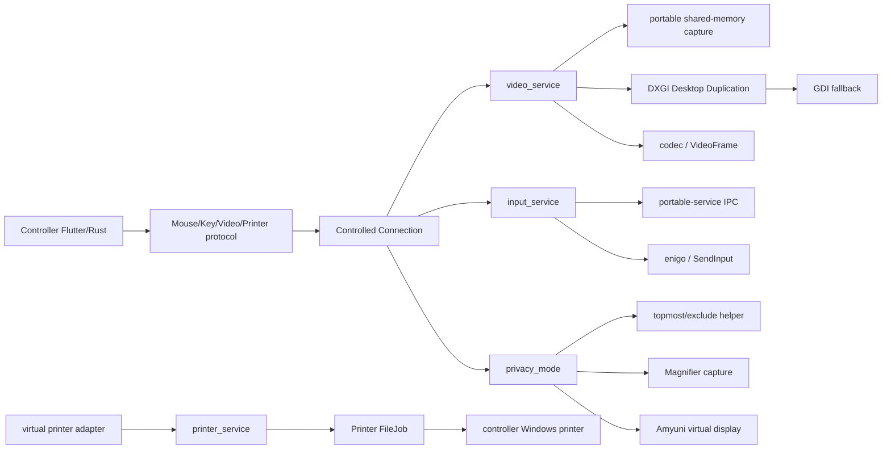

# CloudSend Windows 完整链路 / Windows Pipeline

基线：2026-07-12，`HEAD 77062b4`

> 本文只记录本仓库源码可证明的 Windows capture、input、privacy、Amyuni virtual display 和 printing 路径。`verified` 表示源码直接证实；`inferred` 表示跨文件静态推断；`external` 表示实现位于仓外 DLL/driver；`verification-required` 表示必须在正式 Windows 环境确认。本文不把第三方二进制的预期行为冒充源码事实。

## 1. 范围与源码入口

| 主题 | 主源码 |
|---|---|
| Capture service | `src/server/video_service.rs` |
| DXGI / Desktop Duplication | `libs/scrap/src/dxgi/mod.rs` |
| GDI fallback | `libs/scrap/src/dxgi/gdi.rs` |
| Magnifier capture | `libs/scrap/src/dxgi/mag.rs` |
| Input service | `src/server/input_service.rs` |
| Win32 SendInput | `libs/enigo/src/win/win_impl.rs` |
| Portable service | `src/server/portable_service.rs` |
| Windows platform helpers | `src/platform/windows.rs`，`src/platform/windows.cc` |
| Privacy abstraction | `src/privacy_mode.rs` |
| Privacy helper/window | `src/privacy_mode/win_topmost_window.rs` |
| Privacy Magnifier | `src/privacy_mode/win_mag.rs` |
| Privacy virtual display | `src/privacy_mode/win_virtual_display.rs` |
| Local input block | `src/privacy_mode/win_input.rs` |
| Virtual display manager | `src/virtual_display_manager.rs` |
| Printer capture service | `src/server/printer_service.rs` |
| Printer setup | `libs/remote_printer/` |
| Protocol dispatch | `src/server/connection.rs`，`src/client/io_loop.rs` |

仓库能证明 Rust/C++ 调用契约和部分安装逻辑，但以下运行组件不在当前跟踪源码中：

- `WindowInjection.dll`
- `printer_driver_adapter.dll`
- `usbmmidd_v2` driver package
- RustDesk printer driver package

`RuntimeBroker_cloudsend.exe` 不是缺失的独立工程：`src/platform/windows.rs::check_update_broker_process()` 会复制目标 OS 的 `C:\Windows\System32\RuntimeBroker.exe` 并改名。`PrintXPSRawData` 也已在 `src/platform/windows.cc` 实现，运行时动态加载 OS `XpsPrint.dll`。前述 driver/DLL 标记为 `external / verification-required`；两个 OS-derived 路径标记为 `verification-required`，不能按缺失源码处理。

## 2. 总体架构



Capture、input、privacy、virtual display 和 printer 共用远控 session，但它们分别拥有不同的 OS 资源和恢复责任。尤其不能把“隐私模式开启”简化成只显示一层黑窗。

## 3. Windows capture

### 3.1 Service 层

`src/server/video_service.rs::new(source, idx)` 为每个 monitor/camera index 创建 `GenericService`。Monitor capture 主要流程：

```text
Display::all()
  -> get selected Display
  -> create_capturer()
  -> CapturerInfo
  -> frame(spf)
  -> PixelBuffer or DirectX Texture
  -> color conversion / encoder
  -> VideoFrame
  -> authenticated subscribers
```

`CapturerInfo` 同时记录：

- display origin/width/height
- display count/current index
- privacy-mode owner id
- capturer 实际使用的 privacy id
- `Box<dyn TraitCapturer>`

video loop 每秒检查 display topology；refresh、codec、I444、portable service 状态、desktop 切换或 privacy state 变化都会触发 capturer/encoder `SWITCH` 重建。

### 3.2 Portable-service capture

Windows `create_capturer()` 委托 `portable_service::client::create_capturer()`：

- portable service 正在运行且目标为 primary display：使用 `CapturerPortable`。
- 其他 display 或 portable service 未运行：直接创建 `scrap::Capturer`。

`CapturerPortable` 从跨进程 shared memory 读取：

- `CapturerPara`
- `FrameInfo`
- BGRA frame bytes
- frame counter / would-block flag

主进程与 portable process 通过 IPC heartbeat 和共享内存协作。portable status 变化会强制 video service 重建 capturer。

`inferred`：该路径用于 portable/elevated/desktop boundary 下由另一个进程采集 primary display；具体 UAC/secure-desktop 覆盖率必须真机验证。

### 3.3 DXGI 主路径

`libs/scrap/src/dxgi/mod.rs::Capturer` 使用：

- D3D11 device/context
- `IDXGIOutputDuplication`
- `AcquireNextFrame` / `ReleaseFrame`
- system-memory pixel path或 DirectX texture path
- rotation handling

CPU 路径产出 BGRA `PixelBuffer`；启用 `vram` 且 encoder 支持时可传 DirectX texture。

如果配置关闭 DirectX capture，video service 会立即调用 `set_gdi()`。

### 3.4 GDI fallback

`CapturerGDI`：

- `CreateDCW` 绑定 monitor
- compatible DC/bitmap
- `BitBlt(SRCCOPY | CAPTUREBLT)`
- `GetDIBits`
- mirror/rotate 到 BGRA buffer

自动 fallback 条件包括：

- DXGI 初始创建失败但 GDI 可创建
- 连续无图像/`WouldBlock` 后的 early fallback
- DXGI frame error
- DirectX capture 被配置关闭
- VRAM encoder 与 GDI 状态切换

GDI 使用 `CAPTUREBLT` 捕获 layered windows，但源码注释指出可能导致 cursor blinking。

### 3.5 UAC/desktop/privacy 影响

- `desktop_changed()` 且 portable service 未运行时，video loop 退出并重建。
- Magnifier privacy 下，`check_uac_switch()` 根据 installed 状态和 `consent.exe` 在普通/隐私 capturer 之间切换。
- Magnifier capturer 会按窗口名排除 privacy window。
- Virtual-display privacy 不使用 Magnifier capturer；它改变 display topology，让普通 capture 转向虚拟屏。

## 4. Windows input

### 4.1 端到端链路

```text
Flutter InputModel
  -> Flutter Rust Bridge
  -> ui_session_interface/client
  -> MouseEvent / PointerDeviceEvent / KeyEvent
  -> server/connection.rs
  -> input_service
  -> portable-service IPC or local Enigo
  -> Win32 SendInput
```

Desktop server branches在执行普通 mouse/key/pointer 前检查 `peer_keyboard_enabled()`。这与当前 Android JNI shortcut 的行为不同。

### 4.2 Enigo/SendInput

`libs/enigo/src/win/win_impl.rs` 用 `SendInput` 生成：

- absolute/relative mouse move
- button down/up/click
- horizontal/vertical wheel
- key down/up/click
- Unicode input

注入事件设置 `ENIGO_INPUT_EXTRA_VALUE`。Privacy low-level hook 用该 marker 区分 CloudSend 注入与本机物理输入。

`input_service` 还负责：

- keyboard mode：legacy/map/translate
- modifier 同步
- CapsLock/NumLock 临时调整和恢复
- pressed-key timeout/exit cleanup
- cursor state、mouse-active arbitration
- display coordinate mapping
- lock screen 和 SAS

### 4.3 Portable-service input

Windows `handle_mouse`、`handle_pointer` 和 `handle_key` 总是先进入 portable-service client facade：

- portable service running：protobuf 编码后经 IPC 发到 helper process。
- 未运行：回落到当前进程的 `handle_*_` / Enigo。

因此 portable-service status 影响 capture 和 input 两条链，修改 IPC 时必须同时回归二者。

### 4.4 SAS/secure desktop

`send_sas()`：

- physical console session：向 Windows service IPC 发送 `Data::SAS`。
- 非 physical console：调用 platform `send_sas()`。

是否能覆盖 UAC、Winlogon 和所有 session 类型依赖安装方式、service 权限和 OS policy，标记 `verification-required`。

## 5. Privacy mode 总控

### 5.1 抽象与所有权

`src/privacy_mode.rs::PrivacyMode` 定义：

- init/clear
- turn on/off
- async 标记
- owning connection id
- implementation key

同一时刻只允许一个 connection 拥有 privacy mode：

- 同一 conn + 同一实现：幂等成功。
- 同一 conn 切实现：先 clear/switch。
- 其他 conn 已占用：返回 `OCCUPIED`。
- 非 owner 关闭：返回 `TURN_OFF_OTHER_ID`，除非使用 invalid/system id 强制恢复。

开启/关闭结果通过 `BackNotification.PrivacyModeState` 返回 controller，Flutter 再更新 toolbar/dialog state。

### 5.2 实现选择

默认优先级：

1. Windows 10 build 19041+：`privacy_mode_impl_exclude_from_capture`。
2. 否则 Magnifier 支持时：`privacy_mode_impl_mag`。
3. 否则 installed 模式：`privacy_mode_impl_virtual_display`。

可用实现列表的额外条件：

- topmost/exclude 或 Magnifier 由 OS/capture support 决定。
- virtual display 只有 installed 且 self service running 时才对 peer 发布。

Flutter 从 `platformAdditions["supported_privacy_mode_impl"]` 构造 toolbar。UI 要求不是 view-only，并要求切到 display 1/All；endpoint `turn_on_privacy()` 本身没有显式再次检查 `self.keyboard`，其 permission policy 是否完全由外层保证标记为 `verification-required`。

### 5.3 开启超时

Amyuni virtual-display privacy 被视为 async：

- 另起线程执行。
- 外层最多等待 7.5 秒。
- 内部可等待虚拟显示出现约 6 秒。

超时或任一步失败时 `TurnOnGuard` 尝试关闭并恢复。

## 6. Topmost / exclude-from-capture privacy

`win_exclude_from_capture.rs` 只做两件事：

- 判断 Windows build 19041+。
- re-export `win_topmost_window::PrivacyModeImpl`。

仓内 Rust 实现能证明：

1. 要求当前程序目录存在 `WindowInjection.dll`。
2. 由安装/运行逻辑从目标 OS `RuntimeBroker.exe` 更新 `RuntimeBroker_cloudsend.exe`。
3. 以 active console user token 创建 suspended process。
4. 通过 `VirtualAllocEx`、`WriteProcessMemory`、`QueueUserAPC(LoadLibraryW)` 注入 DLL。
5. 等待名为 `RustDeskPrivacyWindow` 的窗口。
6. 开启时 show，关闭时 hide。
7. 同时启用 low-level keyboard/mouse hooks。

仓库不能证明：

- injected DLL 如何创建/绘制 privacy window。
- 是否以及如何调用 `SetWindowDisplayAffinity(WDA_EXCLUDEFROMCAPTURE)`。
- multi-monitor、DPI、UAC、RDP session 下的实际覆盖。
- 目标 OS `RuntimeBroker.exe` 的 publisher/signature、版本兼容和 EDR 行为，以及 injected DLL 是否与当前 Rust ABI/名称完全匹配。

这些全部是 `external / verification-required`。

### 6.1 注入风险

- 这是远程进程内存写入与 APC DLL injection，高权限且易被 EDR/AV 拦截。
- `STARTUPINFOW.cb` 当前初始化为 0；Win32 API 是否接受、是否导致特定系统失败必须验证。
- 注入分配的 remote buffer 未显式 `VirtualFreeEx`。
- helper 进程由 privacy object drop/stop 直接 `TerminateProcess`。
- 失败路径需确认所有 process/thread/token handle 均正确释放。

## 7. Magnifier privacy

Magnifier 实现复用同一个 privacy topmost window，但 capture 侧改变为：

```text
privacy owner active
  -> video_service::create_capturer()
  -> win_mag::create_capturer()
  -> scrap::CapturerMag
  -> exclude RustDeskPrivacyWindow
  -> Magnification callback frame
```

`CapturerMag` 动态加载 Magnification API，创建 host/magnifier window并通过 callback 得到像素。

开启后 endpoint 会用 `test_create_capturer()` 最多约 5 秒验证能否创建排除 privacy window 的 capturer；失败则关闭 privacy 并回报失败。

UAC/`consent.exe` 会触发 capturer 切换逻辑。其在 installed/portable、secure desktop、多显示器和不同 Windows build 下的真实效果均需验证。

## 8. Virtual-display privacy

### 8.1 开启流程

`src/privacy_mode/win_virtual_display.rs`：

```text
enumerate active displays
  -> split physical vs current IDD DeviceString
  -> ensure one virtual display (default 1920x1080@60)
  -> wait for Amyuni display
  -> snapshot registry connectivity
  -> set virtual display primary at origin 0,0
  -> shift other display origins
  -> disable physical displays
  -> commit ChangeDisplaySettingsEx(CDS_RESET)
  -> set virtual display 1920x1080
  -> save connectivity diff as Config "reg_recovery"
  -> install local input hook
```

如果没有 physical display，代码认为无需 privacy，拔出刚加的 virtual display 并返回 `NO_PHYSICAL_DISPLAYS`。

### 8.2 关闭/恢复

关闭时：

1. unhook local input。
2. 暂时忽略 displays-changed。
3. 用保存的 `DEVMODEW` 恢复 physical/virtual topology。
4. commit display settings。
5. 拔出本次新增的 virtual monitors。
6. 强制恢复 registry connectivity。
7. 清 `reg_recovery`。

`restore_reg_connectivity()` 也被导出供异常启动/清理路径使用。

### 8.3 已知限制

源码明确记录：

- 只能用 `DeviceString` 识别 CloudSend 当前选定的 virtual display。
- 无法区分其他供应商 virtual display 与 physical display。
- Windows 24H2 下，退出 privacy 后可能无法恢复其他 virtual display。
- 快速 plug-out + plug-in Amyuni 可能使 server crash，因此 restore 中刻意不立即 replug。
- display topology 和 registry 恢复是高风险状态变更，不允许只测试 UI 成功消息。

### 8.4 Rust unsafe 风险

该文件多处使用：

```rust
MaybeUninit::uninit().assume_init()
```

构造 `DISPLAY_DEVICEW` / `DEVMODEW` 后再只写部分字段。虽然交给 WinAPI 作为 output struct，直接 `assume_init` 仍是 Rust unsafe/UB 审计点；应改为可证明安全的 zeroed 初始化或 `MaybeUninit` output pattern。

## 9. Amyuni virtual display manager

### 9.1 当前活跃实现

`src/virtual_display_manager.rs` 硬编码：

```rust
const IDD_IMPL: &str = IDD_IMPL_AMYUNI;
```

所以当前 source truth：

- Active：Amyuni/`usbmmidd_v2`。
- Dormant compatibility：RustDesk IDD modules。
- peer platform addition：`idd_impl = "amyuni_idd"`。
- 当前数量字段：`amyuni_virtual_displays`。
- `cloudsend_virtual_displays` 只属于未选用 RustDesk IDD 分支。

### 9.2 支持与驱动

- OS gate：Windows 10 build 19041+。
- DeviceString：`USB Mobile Monitor Virtual Display`。
- 最大 monitor 数：4。
- driver install：
  - x86-on-x64 优先调用外部 `deviceinstaller64.exe`。
  - 其他路径调用 SetupAPI 安装 INF。
- 驱动 I/O：通过 interface GUID 和 `DeviceIoControl` command add/remove monitor。
- headless plug-in 有 3 秒频率限制。
- 第一次 plug-in 后后台尝试把 Amyuni resolution 调到 1920x1080。

外部 driver package、签名、license、版本、hash 和真实 IOCTL ABI 不在仓内源码，均需 artifact provenance。

### 9.3 API 语义差异

统一 API 对 Amyuni 有降级语义：

- `plug_in_monitor(idx, modes)` 忽略 index/modes，只增加一个 monitor。
- `plug_in_peer_request(modes)` 同样只增加一个，并返回 `[0]`。
- 按 indices 拔出时，对每个 index 都调用“拔一个”。

调用者不得把 RustDesk IDD 的 index/mode 精确语义套到 Amyuni。

### 9.4 计数与并发风险

`VIRTUAL_DISPLAY_COUNT` 只是本进程近似值。源码承认：

- driver 可被其他 process 控制。
- CloudSend crash/restart 后 virtual display 仍可能存在。
- 强制拔全部可能影响其他 process 管理的 Amyuni display。

`force_all`、`force_one` 必须只在明确恢复流程使用。

另有静态资源问题：

- `get_display_drivers()` 调用 `SetupDiGetClassDevsW`，但当前函数未见 `SetupDiDestroyDeviceInfoList`，可能泄漏 SetupAPI handle。
- driver async install 通过 `ShellExecuteA` 启动后不直接取得完成状态，只靠短期 retry 使用 driver。

## 10. Local input block in privacy

`win_input.rs` 在独立线程安装：

- `WH_KEYBOARD_LL`
- `WH_MOUSE_LL`

规则：

- `dwExtraInfo == ENIGO_INPUT_EXTRA_VALUE`：允许 CloudSend 注入。
- 其他 mouse event：吞掉。
- 其他 keyboard event：大部分吞掉。
- 本机 `Ctrl+P`：允许触发强制关闭 privacy。
- Alt 组合被阻止，避免 Alt+Tab。

这是“阻止本机操作者、保留远端注入”的核心安全边界。

风险：

- hook 线程依赖 Win32 message loop 和 `PostThreadMessage` 退出。
- hook 安装失败时 privacy window/display 可能已部分改变，必须验证 rollback。
- CloudSend marker 是固定 `dwExtraInfo`，其他本机 process 理论上可伪造；它不是强身份认证。
- Ctrl+P 是本机 emergency escape，不能无意删除或改成远端不可达组合。

## 11. Remote printing

### 11.1 Driver/setup

`libs/remote_printer` 在 Windows 10+ 提供：

- local printer port
- printer driver package upload/install
- local virtual printer creation
- printer/driver/port uninstall

当前仍保留上游名称：

- driver INF path 含 `RustDeskPrinterDriver`。
- driver name 为 `RustDesk v4 Printer Driver`。
- visible printer/port 使用 runtime app name，即 `CloudSend Printer`。

安装是阻塞/高权限操作，Flutter FFI 会在后台线程执行并通过 global event 返回结果。

### 11.2 受控端捕获

仅 `windows + flutter`：

1. `Server::new()` 动态加载 `printer_driver_adapter.dll`。
2. adapter `init(app_name)` 成功后注册 `remote-printer` service。
3. service 每 300ms 请求最近 1000ms 生成的 XPS raw PRN data。
4. 收到数据后调用 `server::on_printer_data()`。
5. 选择第一个支持 remote print 的 authenticated Windows remote connection。
6. 若 `OPTION_ENABLE_REMOTE_PRINTER` 为 true，构造 Printer FileJob；否则向 controller 发送 disallowed message。

adapter 的捕获实现不在仓内，`external / verification-required`。

### 11.3 传输

Printer data 使用现有 file-transfer block protocol，但数据源是 memory cursor：

```text
XPS PRN bytes
  -> fake Printer FsJob path
  -> FileAction Send(type=Printer)
  -> TransferJob memory blocks
  -> controller memory buffer
```

受控端只保留最近 60 秒尚未被 controller 请求的数据。

### 11.4 Controller 执行

Controller Windows 收到 Printer job：

- incoming action 为 dismiss：忽略。
- allow auto print：选默认 printer 或配置的 printer name，自动开始接收。
- 未允许 auto print：向 Flutter 发 `printer_request`，等待用户选择。
- 接收完成后新线程调用 `send_raw_data_to_printer()`。
- 指定 printer 时校验其在本机枚举列表；空 name 使用 default printer。
- 最终调用仓内 `src/platform/windows.cc::PrintXPSRawData()`；该函数动态加载 Windows `XpsPrint.dll` 并取得 `StartXpsPrintJob`。

源码可审查 job/stream 写入、HRESULT 错误路径、cancel/release 和 module cleanup；目标 Windows 是否提供兼容 `XpsPrint.dll`、实际 spool 行为与 printer driver 互操作仍为 `verification-required`。

### 11.5 Printing 风险

- PRN/XPS 整体进入 memory；源码未见独立 printer payload size limit，存在内存压力风险。
- 多个 compatible controller 时只选择第一个 connection。
- adapter DLL 与 printer driver 为外部资产，clean clone 不可重建；`XpsPrint.dll` 是目标 Windows prerequisite，不是应复制进仓库的 CloudSend artifact。
- setup 中部分 driver install/uninstall 错误被 `allow_err!` 后继续，可能形成 partial state。
- `add_printer()` 成功返回的 printer handle 当前未显式 `ClosePrinter`，存在 handle leak 风险。
- 默认 printer name buffer 是否包含尾随 NUL、外部 FFI 是否接受，需要验证。
- 打印内容属于高敏数据，应有明确用户提示、审计、临时数据生命周期和权限策略。

## 12. 构建与打包边界

当前 Windows 推荐入口为 `new-build.cmd`，面向 `C:\DevEnv` + `C:\DevTool`。

脚本/installer 期望打包：

- `cloudsend.dll` 与 Flutter runner
- `WindowInjection.dll`
- `usbmmidd_v2`
- printer adapter/driver
- MSI custom actions

安装/运行逻辑会从目标 OS 派生 `RuntimeBroker_cloudsend.exe`，正式包不应把未知来源的同名 binary 当作仓外依赖注入。仓库只包含部分下载/复制/安装逻辑，不包含所有原始工程或二进制。正式发布前必须维护：

- source/repository/revision
- binary SHA-256
- signer/certificate
- license
- supported architecture
- build command
- reproducibility status

## 13. 风险登记

| 级别 | 风险 | 证据 | 状态 |
|---|---|---|---|
| P0/P1 | Privacy DLL injection 高权限面 | remote memory + APC + user token + helper process | `verified` Rust side，DLL behavior external |
| P0/P1 | Display topology/registry 恢复失败 | virtual primary、disable physical、`reg_recovery` | `verified`，真机矩阵必需 |
| P1 | Windows 24H2 第三方 virtual display 无法恢复 | 源码明确注释 | `verified` limitation |
| P1 | Amyuni 快速 unplug/replug 可使 server crash | restore TODO 注释 | `verified` known risk |
| P1 | WinAPI uninitialized output structs | 多处 `MaybeUninit::assume_init` | `verified` unsafe debt |
| P1 | External artifact provenance 不完整 | DLL/driver 不在 tracked source | `verified` repository gap |
| P1 | Portable shared-memory trust | raw pointer/length/counter 跨进程读取 | `verified`，需 corruption tests |
| P1 | Printer full-buffer memory pressure | PRN data 和 transfer 均可整块驻留 memory | `verified` |
| P1 | Privacy endpoint permission 再检查不明确 | handler ownership明确，但无本地 `self.keyboard` gate | `verification-required` |
| P2 | SetupAPI handle leak | 未见 `SetupDiDestroyDeviceInfoList` | `inferred` |
| P2 | Printer handle leak | `AddPrinterW` handle 未关闭 | `verified` |
| P2 | `STARTUPINFOW.cb=0` | helper process create path | `verified`，运行影响待确认 |
| P2 | Fixed input marker 可伪造 | low-level hook只比较 `dwExtraInfo` | `verified` |
| P2 | Legacy RustDesk naming | privacy window、driver、fake path、error log | `verified` compatibility debt |

## 14. 维护不变量

1. DXGI 是主 capture，GDI 是可恢复 fallback；不能删除 fallback 而没有 GPU/driver 矩阵。
2. Portable-service status 改动必须同时回归 capture 和 input。
3. Privacy 是 connection-owned 状态，其他 peer 不能关闭 owner 的 privacy。
4. Privacy 失败必须恢复 input hook、window、display topology 和 registry connectivity。
5. `Ctrl+P` local emergency exit 必须保留或由等价、本机可达机制替换。
6. Amyuni 与 RustDesk IDD 的 index/mode 语义不同，不能混用。
7. 强制 unplug-all 只用于明确的故障恢复。
8. External DLL/driver 未经 provenance、hash、signature 和 clean-machine 验证不得发布。
9. Printer job 必须尊重 endpoint enable option 与 controller auto-print/confirm option。
10. Printer payload、temp/memory data 和审计记录必须有上限与生命周期。

## 15. 正式环境验证矩阵

本轮未编译、未测试。无法由源码证明的项目统一列为 `verification-required`：

| ID | 场景 | 操作 | 通过标准 |
|---|---|---|---|
| W01 | DXGI normal | 多显示器、旋转、DPI、GPU vendor matrix | 稳定 BGRA/texture；无持续 leak |
| W02 | DXGI failure | 禁用 DirectX、制造 WouldBlock/device lost | 自动 GDI fallback，session 不崩溃 |
| W03 | GDI | layered window/cursor/video | 图像方向正确；cursor blinking 可接受 |
| W04 | Portable installed/portable | UAC、桌面切换、primary/non-primary | shared-memory capture/input 正确切换 |
| W05 | Shared-memory corruption | length/counter/size 不一致 | 安全拒绝，不能越界读取 |
| W06 | Input permission | keyboard on/off、view-only | endpoint 只在授权时执行普通输入 |
| W07 | SAS | console、RDP、UAC、lock screen | service IPC 权限正确，无错误 desktop |
| W08 | Topmost privacy | Win10/11、multi-monitor、DPI | helper/DLL 可启动、show/hide、退出完整清理 |
| W09 | Exclude privacy | 19041+ 各 capture API | 本机遮挡，远端画面符合产品定义 |
| W10 | Magnifier privacy | UAC/consent、installed/portable | privacy window 被排除，capturer test 可恢复 |
| W11 | Virtual privacy | 单/多屏、existing third-party VD | virtual primary 正确，physical 屏禁用 |
| W12 | Virtual privacy failure | 中途 kill/crash/reboot | `reg_recovery` 可恢复原 topology |
| W13 | Windows 24H2 | existing virtual displays | 记录无法恢复的边界，不误拔第三方设备 |
| W14 | Amyuni lifecycle | plug 1—4、rapid operations、other process | 频率限制生效，无 server crash/误拔 |
| W15 | Driver install | x64、x86-on-x64、clean machine | INF/signature/async install 可追溯 |
| W16 | Privacy hooks | physical keyboard/mouse、Enigo、Ctrl+P | 本机输入阻断；远端输入通过；escape 可用 |
| W17 | Printer install | clean Win10/11，install/update/uninstall | printer/port/driver 无 partial state或 handle leak |
| W18 | Printer consent | disabled/confirm/auto/default/selected | endpoint和controller选项全部生效 |
| W19 | Printer load | 大 XPS、并发 job、multiple controllers | 有 size limit；不 OOM；目标 controller 明确 |
| W20 | External artifacts | clean clone + approved artifact set | DLL/driver hash、签名、版本和 ABI 全部匹配 |

正式 PC 构建机应在仓库根目录执行 `new-build.cmd`。其环境必须符合 `PC-Build.md` 的 `C:\DevEnv` / `C:\DevTool` 布局。任何安装 driver、运行注入 helper、安装 printer、发布或上传操作仍需用户明确授权。
