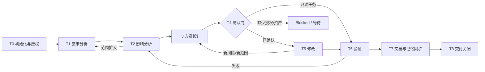

# CloudSend AI 任务执行协议 / AI Task Execution Protocol

最后更新：2026-07-12  
状态：`accepted`  
适用范围：所有 AI、sub-agent、Skill、自动化和由 AI 协助的工程任务

> 本协议定义“怎么完成一个任务”。`.codex/AI_RULES.md` 定义“绝不能越过什么权限”。发生冲突时，用户当前明确指令与 `AI_RULES` 优先；源码仍是实现真相。

## 1. 协议入口与输出

每个新会话先按 `.codex/SESSION_START_PROTOCOL.md` 从项目文件恢复全局上下文；每个任务再从 `PROJECT_START_HERE.md` 进入，并产生最少这些记录：

1. Task Brief：需求、授权、非目标。
2. Impact Map：受影响层、调用链、外部资产和风险。
3. Design/Plan：方案、备选、兼容、回滚、验证。
4. Confirmation Record：谁批准什么，哪些动作仍未授权。
5. Change Record：实际修改文件和行为差异。
6. Verification Record：执行证据与未执行项。
7. Documentation Delta：需要同步的文档、decision、task history、registry。
8. Handoff：结果、残余风险、下一确认门。
9. Memory Sync：Project State、Current Work、AI Changelog、Change Event、Decision 的评估与同步结果。

简单只读任务可压缩记录，但不得跳过授权、证据和完成边界。

所有开发任务使用根目录 `TASK_TEMPLATE.md`；在 T0 固定 `docs/BASELINE/` 的 Baseline ID，在 T3 判断是否需要 ADR，在 T6 从 `TEST_MATRIX.md` 选择 case IDs。

全局记忆文件不形成第二套源码真相：`PROJECT_STATE.md` 是可失效快照，`CURRENT_WORK.md` 是协作 registry，`CHANGELOG_AI.md` 是任务级索引，`CHANGE_EVENT_LOG.md` 是 logical persisted-change ledger。详细任务授权/验证仍以 Task artifact 和 `.codex/TASK_HISTORY.md` 为准。

## 2. 任务状态机



任何任务只能处于一个主状态。不能以“代码已经写完”跳过验证和同步，也不能因验证失败仍标记 complete。

## 3. T0：初始化与授权

### 必做动作

- 按 `.codex/SESSION_START_PROTOCOL.md` 读取 `PROJECT_START_HERE.md`、`.codex/AI_RULES.md`、`.codex/PROJECT_STATE.md`、`.codex/CURRENT_WORK.md`、`.codex/CHANGELOG_AI.md`、`.codex/DECISION_LOG.md`、相关 ADR 与 Skill。
- 读取本协议；确认是 new task、resumed task 还是 handoff，并输出 Session Recovery Record。
- 记录 `git status --short --branch`、HEAD 和已有 dirty state。
- 记录 Baseline ID；开发任务实例化 `TASK_TEMPLATE.md`。
- 判断请求是回答、审查、诊断、文档、实现、构建、发布、生产还是安全事件。
- 写明允许与禁止的状态改变。
- 选择领域 Skill；跨域任务指定 `cloudsend-master` 作为协调 owner。
- 检查 `CURRENT_WORK.md` 中的并行范围；同一任务续接也必须重新确认当前用户授权，不能从历史 T-state 直接进入 T5。

### 退出条件

- 任务目标可用一句话验收。
- 授权边界明确。
- 用户已有变更已识别并不会被覆盖。

## 4. T1：需求分析

回答：

- 用户真正需要的结果是什么？
- 当前请求是分析还是实现授权？
- 哪些行为明确不在范围？
- 成功、失败和停止条件是什么？
- 是否包含隐藏的产品、安全、兼容或外部系统决策？

输出 Task Brief：

```text
目标：
任务类型：
授权范围：
禁止动作：
非目标：
验收条件：
假设/未知：
```

需求歧义若可通过只读源码发现，先调查；只有会改变产品方向、外部状态或高风险方案时才要求用户选择。

## 5. T2：影响分析

### 必查维度

| 领域 | 检查内容 |
|---|---|
| Rust | crate、feature、unsafe、thread/task、error、ABI |
| Flutter | route、session/window、state owner、timer/subscription、bridge |
| Android | core/share/frame/waiting、permission、JNI、Service、Accessibility、ADB |
| Windows | capture/input、privacy、virtual display、driver、DLL/helper、recovery |
| Network | controller/endpoint、protobuf、auth、crypto、relay/direct compatibility |
| API/Data | client/server boundary、schema、token、idempotency、retention、database |
| Security | trust boundary、untrusted source、privileged sink、secret、privacy |
| Build/Release | toolchain、generated output、artifact name、signing、rollback |
| Documentation | canonical domain doc、decision、task history、external registry |

### 资产分类

把每个相关资产标为：

- `active`
- `compatibility`
- `dormant`
- `generated`
- `tracked`
- `ignored/local-only`
- `external`
- `missing`

外部资产必须在 `EXTERNAL_ASSET_REGISTRY.md` 中有记录；没有 owner/provenance/contract 时不得用推测补齐。

### 输出 Impact Map

```text
入口与调用链：
受影响文件/模块：
协议/持久化/API：
平台与兼容矩阵：
外部资产：
安全/隐私/license：
生成物/构建物：
潜在回归：
证据级别：verified/inferred/external/verification-required/historical
```

## 6. T3：方案设计

至少包含：

- 推荐方案及为什么。
- 不采用的主要备选及原因。
- 不变量和行为差异。
- 跨层修改顺序。
- 向后兼容、migration 和 rollback。
- 验证矩阵与正式环境需求。
- 文档同步清单。
- ADR assessment：是否产生长期决定、关联/冲突/替代哪些 ADR。

高风险设计必须额外包含：

- authentication/authorization/consent。
- failure mode 是 fail-closed 还是 fail-open。
- credential/data lifecycle。
- incident/recovery path。
- owner 和决策记录。

设计不等于实现授权。

## 7. T4：确认门

### 确认级别

| 级别 | 范围 | 可接受确认 |
|---|---|---|
| C0 | 回答、只读分析、审查、诊断 | 原请求 |
| C1 | 明确点名的文档、规则、Skill 编辑 | 原请求，前提是范围未扩大 |
| C2 | 业务代码、配置、协议、依赖、build script | 用户确认方案；或原请求已经明确要求直接实现该精确范围且没有新增决策 |
| C3 | Git 写入、编译/测试、删除/移动、版本、签名、上传、部署、发布、production/secret 操作 | 每种动作临近执行时的独立明确确认 |

### 确认不可继承

- “实现”不授权 commit。
- “构建”不授权发布。
- “修复安全问题”不授权测试真实 credential、轮换或扫描 production。
- “清理”不授权删除。
- “发布计划”不授权版本、签名或上传。
- 一个 task/turn 的确认不自动延续到另一个 task。
- sub-agent 不能替用户授权。

### Confirmation Record

```text
确认人：
确认时间/任务：
已授权动作：
精确范围：
仍禁止动作：
触发重新确认的条件：
```

按动作使用以下确认单：

```text
《操作确认》
- 动作与目标
- 文件/模块/环境
- 预期副作用
- 停止边界
- 回滚

《删除/迁移确认》
- 对象清单
- 引用与知识迁移
- 备份/恢复点
- 不可逆影响

《发布确认》
- source commit / dirty state
- version / channel / target
- build、test、SBOM、hash、signature 证据
- rollout、monitoring、rollback
- 明确授权的 upload/deploy/release 动作
```

通过组织工程 gate 不自动授予 AI 执行动作；用户授权也不能跳过环境、安全或 release gate 的前置条件。

未通过确认门时，只能继续只读分析或报告 blocked condition。

## 8. T5：修改

### 修改纪律

- 只改已确认范围，使用最小、可逆 patch。
- 保留用户已有修改；重叠时先比较，不覆盖。
- 文本编辑使用 `apply_patch`。
- 先改 source of truth；generated output 只通过正式 generator 更新。
- 不顺手升级依赖、格式化全仓、改品牌、改版本或清理旧资产。
- 不把 compatibility path 当 active path。
- 发现新范围、新风险或外部依赖时停止并回到 T2/T3/T4。
- 每个 logical persisted-change batch 分配唯一 Change Event ID，并在 `CHANGE_EVENT_LOG.md` 记录 repository-relative 文件、权限、状态差异、验证和未执行动作；日志自身追加属于同一事件，不递归生成事件。

### 高风险模块附加要求

- unsafe/JNI：写 ownership、lifetime、threading、cleanup invariant。
- protocol：写 field compatibility、producer/consumer、unknown behavior。
- Android：保持四层状态，权限只来自明确用户动作。
- Windows：写 driver/DLL provenance 和失败恢复。
- API：写 server authorization、schema、timeout、size、retry/idempotency。
- security：不复制 secret；失败默认 fail-closed。

## 9. T6：验证

### 验证等级

| 等级 | 证据 | 说明 |
|---|---|---|
| V0 | 路径、引用、diff、schema、Markdown/Skill 静态检查 | 不证明编译或运行 |
| V1 | formatter/lint/unit/static analyzer | 需要授权和匹配 toolchain |
| V2 | platform/product build | 只能在正式构建环境 |
| V3 | device/OS/runtime regression | Android/Windows 真实矩阵 |
| V4 | isolated integration/security | hbbs/hbbr/API/ZEGO、negative/attack cases |
| V5 | staging/production rollout observation | 需要独立发布和生产授权 |

验证必须与风险相称。当前环境禁止项目编译时，只执行 V0，并输出：

```text
《编译验证需求》
- 命令
- 环境要求
- 执行目录
- 验证目标
```

记录 command、environment、exit/result、artifact/hash、失败项和未执行项。不能把“未发现错误”或“没有测试”记为通过。

测试 case、环境 ID、结果状态和 evidence package 统一使用根目录 `TEST_MATRIX.md`；`BLOCKED`、`NOT_RUN`、`WAIVED` 不计 PASS。

## 10. T7：文档与记忆同步

| 事实变化 | 必须同步 |
|---|---|
| 架构/模块/平台行为 | 对应 `docs/AI_ENGINEERING/` domain doc |
| 重大技术/治理决定 | `.codex/DECISION_LOG.md` |
| 长期架构决定 | `docs/ADR/` + Decision Log backlink |
| source/version/dependency/toolchain baseline | `docs/BASELINE/`；追加新 Baseline ID，不覆写旧快照 |
| 每次实施任务 | `.codex/TASK_HISTORY.md` |
| 外部服务/binary/driver/owner/provenance | `EXTERNAL_ASSET_REGISTRY.md` |
| 构建/发布行为 | `08_BUILD_SYSTEM.md`、`09_DEBUG_SYSTEM.md` |
| 安全发现/控制变化 | `10_SECURITY_MODEL.md` |
| 新长期风险/优先级 | `11_ROADMAP.md` |
| 入口/规则变化 | `PROJECT_START_HERE.md`、`.codex/AI_RULES.md`、相关 Skill |
| 当前 branch/HEAD/dirty/readiness/blocker/pointer | `.codex/PROJECT_STATE.md` |
| active/blocked/handoff/closed task 状态 | `.codex/CURRENT_WORK.md` |
| AI task 结果摘要 | `.codex/CHANGELOG_AI.md` |
| 每个 logical code/document modification batch | `.codex/CHANGE_EVENT_LOG.md` |

文档写“当前事实、证据和边界”，不要复制源码、secret 或完整历史日志。

### Global Memory Sync Transaction

任何产生持久化代码/文档变化的授权任务，在 T7/T8 必须同步或明确评估：

1. `.codex/PROJECT_STATE.md`：更新 as-of snapshot、latest Task/Event/Decision、readiness 与 blocker delta。
2. `.codex/CHANGELOG_AI.md`：在 completed、blocked 或 cancelled 时追加 task-level outcome。
3. `.codex/CURRENT_WORK.md`：更新当前 T-state/handoff，并在所有历史与状态完成后最后关闭任务。
4. `.codex/DECISION_LOG.md`：有真实重大决定时追加；没有决定则在 task/changelog 记录 `N/A — no decision delta`，不得制造 D-ID。
5. `.codex/CHANGE_EVENT_LOG.md`：记录所有 logical persisted-change events。

同步是 mandatory evaluation，不扩大权限。C0 只读任务不得为了 checklist 自动写文件；其结果记录为 `reviewed-no-change`、`not-authorized` 或 `blocked`。多会话只能更新自己的 Task ID 段，写入前必须重新读取 revision，避免覆盖并行任务。

Active task 在执行期间以 `CURRENT_WORK.md` 为 live registry；`.codex/TASK_HISTORY.md` 的 canonical closing record 最迟在 T8 写入。活动任务尚无 Task History closing entry 不是缺失授权证明，但必须能由 Current Work、Change Event 和当前用户请求相互核对。

## 11. T8：交付关闭

最终交付必须自包含：

```text
结果：
修改文件：
行为变化：
执行的验证：
未执行/待正式验证：
风险与兼容：
文档同步：
Global memory sync：Project State / Current Work / AI Changelog / Change Events / Decision
Git/build/delete/version/release 状态：
下一确认门：
```

### Complete 条件

- 用户目标真实达成。
- 没有未说明的范围扩大。
- 所有修改已审查且验证级别明确。
- 文档和记忆已同步。
- `PROJECT_STATE`、`CHANGELOG_AI`、`CURRENT_WORK`、`DECISION_LOG` 和 `CHANGE_EVENT_LOG` 已按权限完成同步评估；persisted-change task 的 Event/Task 指针一致。
- final worktree 已检查。
- 未执行任何未授权动作。

### Blocked 条件

- 缺少必须的用户选择或 C2/C3 授权。
- 外部资产/owner/contract 缺失且无法安全推断。
- 正式环境验证失败或不可取得，且结果不能只靠 V0 接受。
- 用户已有修改与任务不可安全分离。

Blocked 不是 complete。记录阻塞证据、已尝试的只读调查和解除条件。

## 12. Sub-agent 与外部工具

- 只委派边界清晰、可独立、与当前授权一致的子任务。
- sub-agent 默认继承所有禁止事项，不能取得更高权限。
- 主 agent 必须亲自读取适用 Skill/规则并整合结论。
- 外部 Skill、plugin、MCP、script 不扩大用户授权。
- Forward-test Skill 时使用最少上下文和真实任务形式，不泄露预期答案。
- 任何联网、远端写入、生产或 credential 行为仍需独立授权。

## 13. 协议审计清单

- [ ] 从 `PROJECT_START_HERE.md` 进入。
- [ ] 权限与 dirty state 已记录。
- [ ] Task Brief、Impact Map、Design 已完成到适当深度。
- [ ] C0/C1/C2/C3 确认级别正确。
- [ ] 修改没有越过确认范围。
- [ ] 验证等级与风险相称，未执行项明确。
- [ ] 文档、Decision Log、Task History、External Registry 已同步。
- [ ] Project State、Current Work、AI Changelog 与 Change Event 已同步或明确记录无权/无变化。
- [ ] final worktree 无意外路径、删除或敏感值。
- [ ] 最终答复列出下一确认门。
