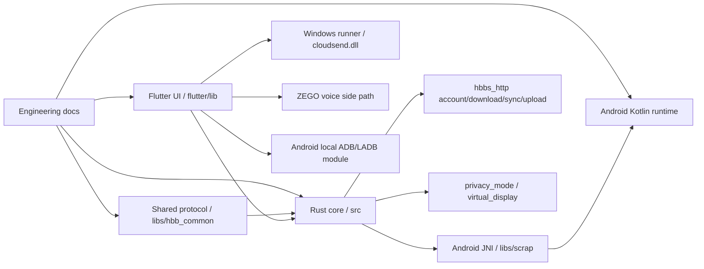

# 工程总索引 / Engineering Index

最后一次基于全仓源码核验：2026-06-09
最近一次文档一致性复核：2026-06-09

> 这是 **Codex / Claude Code / 人工开发者** 在进入本仓库后的第一份文档。
> 目标不是替代源码，而是提供**稳定、可检索、不会被中文措辞歧义污染**的工程记忆层。
> 本文件中的中文叙述用于解释；**文件名、类名、函数名、常量名、协议字段名、命令名一律保留英文原文**。

---

## Current CloudSend Source Truth (2026-06-09)

- Product/runtime app name: `CloudSend`.
- Android package/applicationId: `com.cloudsend.app`.
- Android visible label: `云计划`.
- Android scheme: `cloudsend`.
- Kotlin package root: `flutter/android/app/src/main/kotlin/com/cloudsend/app/`.
- Rust crate and library name: `cloudsend`.
- Rust crate version: `5.2.1`.
- Flutter app version: `5.2.1+59`.
- Android SO artifact: `libcloudsend.so`.
- Android SO loading: `System.loadLibrary("cloudsend")` and `DynamicLibrary.open('libcloudsend.so')`.
- Windows DLL artifact/loading: `cloudsend.dll`.
- Current Windows build script: `new-build.cmd`; output directory: `PC-Bulid`.
- Rust exported FFI symbols: `cloudsend_core_main` / `cloudsend_core_main_args`.
- Android status protocol: `cloudsend_status`, `CloudSendStatusModel`, `CloudSendStatusMonitor`, `show_cloudsend_status_monitor`.
- Virtual display platform addition key: `cloudsend_virtual_displays`.
- ZEGO voice-call architecture/integration docs: `docs/ZEGO_VOICE_CALL_ARCHITECTURE.md`, `docs/ZEGO_VOICE_CALL_INTEGRATION.md`, and `docs/ZEGO_TOKEN_SERVICE_DEPLOYMENT.md`.
- ZEGO voice-call runtime anchors: `ZegoVoiceCallInfo`, `ZegoVoiceCallModel`, `zego_voice_call_ready`, `Data::ZegoVoiceCallReady`.
- ZEGO voice-call Android permission anchors: `android.permission.RECORD_AUDIO`, `android.permission.MODIFY_AUDIO_SETTINGS`, `android.permission.BLUETOOTH`, `android.permission.BLUETOOTH_CONNECT`, `android.permission.USE_FULL_SCREEN_INTENT`, `flutter/android/app/proguard-rules`.
- ZEGO voice-call isolation rule: do not modify video frame flow, Android `MediaProjection`, side-button command protocol, ADB/LADB, file transfer, clipboard, terminal, or port-forwarding unless a future task proves direct involvement.
- PC developer login bypass anchor: `flutter/lib/models/developer_login_bypass_model.dart`; `Ctrl+Shift+H` enables a process-only connection bypass for developers without changing product account login state.
- Android core connection/id service and Android screen sharing are split: app startup keeps `DFm8Y8iMScvB2YDw` online through `ServerModel.ensureCoreService()`, while `start_screen_share` / `stop_screen_share` only control `MediaProjection`.
- Android network / screen / memory events refresh the existing core keep-alive resources through `DFm8Y8iMScvB2YDw.refreshCoreKeepAlive(...)`; they do not restart `MainService`, rewrite `_isReady`, or stop screen sharing.
- Android 14+ `MediaProjection` token / `createVirtualDisplay()` is one-shot, and Android 15 QPR1+ may stop projection on lock screen. Projection stop must be handled as screen-share loss only; it must not clear Rust JNI context, stop `MainService`, or close the relay session.
- Non-explicit `MainService.onDestroy()` keeps Rust JNI context while the app process is alive and requests a guarded `ACT_ENSURE_CORE_SERVICE` restart. Only explicit app/service destroy clears the core JNI context.
- Android visible `connectStatus` follows the official RustDesk-style raw rendezvous registration state: `mainGetConnectStatus()` `status_num` is assigned directly to `_connectStatus`. Do not debounce it or fake readiness, and do not treat it as proof that the core service died.
- CloudSend client sessions are strict relay-only. `src/client.rs::LoginConfigHandler.initialize(...)` defaults `force_relay = true`, Android auto reconnect calls `sessionReconnect(..., forceRelay: true)`, and `Client::_start(...)` / `Client::connect(...)` must not create UDP/IPv6/direct candidates while force relay is active. Explicit IP/domain:port direct connection is rejected in relay-only mode.
- Android auto reconnect handles `input-password` / `re-input-password` by reusing the current PC process cache for that peer, with build-in `default-connect-password` as the fixed-password fallback. It must not use the local `mainGetPermanentPassword()` as a remote password.
- ZEGO voice call is a Flutter RTC side path attached to the existing control-channel invitation state machine. PC/Android media goes through ZEGO only; old RustDesk `audio_service` voice-call media must stay unused.
- PC ZEGO voice-call entrypoints and `src/client/io_loop.rs::Data::NewVoiceCall` no longer gate on `PeerInfo.platform == Android`; the current connected session may attempt a ZEGO invite so misidentified Android devices are not blocked by a platform string.
- Android ZEGO stale local busy state is cleared from disconnected clients and stale `ZegoVoiceCallModel.active` before rejecting a new incoming call.
- Android local ADB/LADB is an isolated Android-side module under `flutter/android/app/src/main/kotlin/com/cloudsend/app/adb/` and `flutter/lib/mobile/pages/adb_page.dart`; it must not be mixed into screen-share, side-button, video, screenshot, or status-monitor paths.

This section overrides any older Daxian/RustDesk naming text that remains in historical notes below.

## 0. 使用约定（必须遵守）

### 0.1 真相优先级（Source of Truth Order）

1. **当前源码**
2. `docs/ENGINEERING_BASELINE.md`
3. `docs/ENGINEERING_ANDROID_RUNTIME.md`
4. `docs/TASK_ENTRYPOINTS.md`
5. `docs/REPO_TRUE_STRUCTURE_MAP.md`
6. `docs/DOCUMENT_AUDIT.md`
7. `docs/SOURCE_TRUTH_AUDIT_2026_05_18.md`
8. `docs/ADB_LADB_INTEGRATION_MEMORY.md` (only for ADB/LADB integration tasks)
9. `AGENTS.md`
10. `CLAUDE.md`
11. `terminal.md`

说明：

- `AGENTS.md` 和 `CLAUDE.md` 是 agent 入口速查；它们有参考价值，但不能高于源码与工程文档。
- `terminal.md` 仍有参考价值，但存在**局部漂移**，不能高于源码与工程文档。
- 当工程文档与源码冲突时，**以源码为准**，并同步更新工程文档。
- `AGENTS.md` 必须只做 Codex 补充入口，并显式指向本文件，不得另起一套相互竞争的项目记忆。

### 0.2 文档写法约定（Canonical Writing Contract）

为了让 Codex / Claude Code 稳定读取，后续所有工程文档必须遵守以下格式：

- 中文用于解释业务含义与风险。
- 英文用于保持代码锚点稳定；不得翻译以下内容：
  - 文件路径
  - 类名 / 函数名 / 结构体名 / enum / 常量
  - protobuf message / field 名称
  - Android action / permission / service name
  - Cargo feature / Gradle property / build artifact name
- 任何关键概念首次出现时，写成：
  - `中文名 (Canonical English Term)`
  - 例：首帧等待（`waiting-for-first-frame`）
- 任何运行时结论，都至少给出**一个代码锚点**，格式为：
  - `文件路径` + `符号名/关键字符串`
- 不要用“它 / 那里 / 这条逻辑”这种无锚点指代来替代真实符号。
- 不要把“猜测、经验、上游 RustDesk 印象”写成既定事实。
- 不要把多个近义词混用。必须优先使用本文档定义的 canonical term。

### 0.3 文档同步规则（Doc Sync Rule）

每次代码修改后，执行下面的最小同步动作：

1. 重新检索改动链路涉及的所有层：
   - Flutter / Rust FFI / server / platform / Android Kotlin / build script
2. 判断是否改变了：
   - 入口文件
   - 状态机 / 运行时不变量
   - 协议消息形状
   - 构建产物命名
   - 文档审计结论
3. 若改变，至少同步更新：
   - `docs/ENGINEERING_BASELINE.md`
   - 若涉及 Android 运行时，再更新 `docs/ENGINEERING_ANDROID_RUNTIME.md`
   - 若涉及入口或维护方式，再更新 `docs/TASK_ENTRYPOINTS.md`
   - 若文档真实性发生变化，再更新 `docs/DOCUMENT_AUDIT.md`
4. 更新时继续使用**中文解释 + English anchor + precise file path** 的写法。
5. 不要创建新的“记忆型文档”与本套文档竞争，除非现有文档结构已经证明无法承载。

---

## 1. 阅读顺序（Reading Order）

### 1.1 所有任务通用

1. `docs/ENGINEERING_INDEX.md`
2. `docs/ENGINEERING_BASELINE.md`
3. `docs/TASK_ENTRYPOINTS.md`
4. 对应源码入口文件

### 1.2 Android 运行时 / 重连 / 黑屏 / 无视 / 保活任务

1. `docs/ENGINEERING_INDEX.md`
2. `docs/ENGINEERING_BASELINE.md`
3. `docs/ENGINEERING_ANDROID_RUNTIME.md`
4. `docs/TASK_ENTRYPOINTS.md`
5. Android 源码链路

### 1.3 结构摸底 / 全仓定位

1. `docs/ENGINEERING_INDEX.md`
2. `docs/REPO_TRUE_STRUCTURE_MAP.md`
3. `docs/ENGINEERING_BASELINE.md`

### 1.4 文档是否可信 / 是否漂移

1. `docs/DOCUMENT_AUDIT.md`
2. 回到对应源码核验

### 1.5 第三方 ZEGO 语音通话

1. `docs/ZEGO_VOICE_CALL_ARCHITECTURE.md`
2. `docs/ZEGO_VOICE_CALL_INTEGRATION.md`
3. `docs/ZEGO_TOKEN_SERVICE_DEPLOYMENT.md`
4. `docs/TASK_ENTRYPOINTS.md` 的 `ZEGO Voice Call Entrypoints`
5. 对应源码入口文件

### 1.6 ADB / LADB 专题

1. `docs/ADB_LADB_INTEGRATION_MEMORY.md`
2. `docs/TASK_ENTRYPOINTS.md`
3. 对应源码入口文件

---

## 1B. 新工程师接手路径（New Engineer Handoff Path）

当没有任何历史对话、上下文或本机记忆时，按下面顺序建立项目认知：

1. 先读 `AGENTS.md`，确认项目身份、构建纪律和 Codex 入口规则。
2. 读 `docs/ENGINEERING_INDEX.md` 的 `Current CloudSend Source Truth`、`Reading Order`、`Document Catalog`。
3. 读 `docs/ENGINEERING_BASELINE.md` 的项目身份、顶层架构、主链路和当前风险。
4. 如果任务涉及 Android 被控端、屏幕共享、首帧、无视/穿透/黑屏/重连，继续读 `docs/ENGINEERING_ANDROID_RUNTIME.md`。
5. 如果任务涉及定位代码入口，读 `docs/TASK_ENTRYPOINTS.md`，再进入对应源码。
6. 如果任务涉及目录结构或跨层关系，读 `docs/REPO_TRUE_STRUCTURE_MAP.md`。
7. 如果任务涉及文档可信度、历史文档或上游 README，先读 `docs/DOCUMENT_AUDIT.md`。

快速心智模型：



交接原则：

- 先信当前源码，再信工程主套件。
- 专题文档只服务对应专题，不能覆盖全仓主事实。
- `README.md`、`docs/README-ZH.md`、`terminal.md`、`PC-Build.md` 的历史/上游语境必须回源码核验。
- Git 跟踪文档不得保存服务器密码、`ZEGO_SERVER_SECRET`、私有 token 或真实运维凭据；部署时从私有运维记录补齐。

---

## 1A. 文档分层目录（Document Catalog）

本仓库文档按用途分层。不要把历史说明、上游社区文档或专题记录当成当前工程真相。

| 分类 | 文档 | 用途 | 可信边界 |
|---|---|---|---|
| 工程入口 | `docs/ENGINEERING_INDEX.md` | 全仓文档入口、阅读顺序、写法规则 | 第一入口，但不承载全部实现细节 |
| 工程真相 | `docs/ENGINEERING_BASELINE.md` | 项目身份、架构、关键链路、构建/品牌现实 | 高可信；仍以源码为最终真相 |
| Android 运行时 | `docs/ENGINEERING_ANDROID_RUNTIME.md` | Android service/frame/waiting/runtime 不变量 | Android 任务必须阅读 |
| 任务导航 | `docs/TASK_ENTRYPOINTS.md` | 按任务类型给出第一批源码入口 | 入口地图，不是设计文档 |
| 结构地图 | `docs/REPO_TRUE_STRUCTURE_MAP.md` | 全仓目录职责和跨层关系 | 快速定位；细节仍回源码 |
| 可信审计 | `docs/DOCUMENT_AUDIT.md` | 文档可信等级和漂移边界 | 判断文档能不能直接信 |
| 源码审计 | `docs/SOURCE_TRUTH_AUDIT_2026_05_18.md` | 2026-05-18 命名/源码事实审计记录 | 固定日期审计，不自动代表未来 |
| ZEGO 专题 | `docs/ZEGO_VOICE_CALL_ARCHITECTURE.md` | ZEGO 语音工程链路、图、官方 Demo 对齐 | ZEGO 方案主设计文档 |
| ZEGO 专题 | `docs/ZEGO_VOICE_CALL_INTEGRATION.md` | ZEGO 接入边界、协议、运行时规则 | ZEGO 实现维护文档 |
| ZEGO 专题 | `docs/ZEGO_TOKEN_SERVICE_DEPLOYMENT.md` | 宝塔/Nginx/Go Token 服务部署 | 部署操作文档，不能写真实密钥 |
| ADB 专题 | `docs/ADB_LADB_INTEGRATION_MEMORY.md` | ADB/LADB 集成上下文和后续方案 | 仅 ADB/LADB 任务使用 |
| Agent 入口 | `AGENTS.md`, `CLAUDE.md` | Codex / Claude Code 快速入口和常用锚点 | 补充导航，不高于工程主套件 |
| 构建背景 | `PC-Build.md` | Windows Server 构建环境背景和旧上游流程 | 环境参考；当前命令以 `new-build.cmd` 为准 |
| 历史设计 | `terminal.md` | terminal 子系统历史设计背景 | 等级 C；必须回源码核验 |
| 历史记录 | `docs/CHANGELOG.md` | 已发生变更记录 | 历史参考，不作为当前实现入口 |
| 上游/社区 | `README.md`, `docs/README-ZH.md`, `docs/CONTRIBUTING*.md`, `docs/CODE_OF_CONDUCT*.md`, `docs/SECURITY.md`, `docs/DEVCONTAINER.md` | 上游说明、贡献、行为、安全、开发容器 | 参考/社区文档，不高于工程主套件 |

---

## 2. 文档用途（What Each Doc Is For）

### `docs/ENGINEERING_BASELINE.md`

记录**已经通过源码核验**的项目身份、真实架构、关键链路、品牌/构建现实、已知风险与漂移。

### `docs/ENGINEERING_ANDROID_RUNTIME.md`

记录 Android 端真实运行时模型，包括：

- 服务状态 vs 帧源状态 vs PC 等首帧状态
- `MediaProjection`、ignore fallback、overlay keep-alive
- Android 10 与 Android 11+ 的能力边界
- 不得回归的运行时不变量

### `docs/TASK_ENTRYPOINTS.md`

按“改动类型”组织入口文件和检查清单，目的是让 agent 修改代码时从**正确的第一批文件**开始，而不是盲搜。

### `docs/REPO_TRUE_STRUCTURE_MAP.md`

记录全仓真实结构图，帮助快速判断：

- 哪些目录是主路径
- 哪些目录是兼容路径
- 哪些目录是平台专有实现
- 哪些目录和文档主链强相关

### `docs/DOCUMENT_AUDIT.md`

审计各类文档与当前代码的关系：

- 哪些可信
- 哪些部分可信
- 哪些已经过时
- 哪些只能当历史背景

### `AGENTS.md` / `CLAUDE.md`

现有的 Codex / Claude Code 仓库说明。它们是有用的入口，但应服从 `docs/ENGINEERING_INDEX.md` 与基线文档，不应与本套工程文档冲突。

---

## 3. 快速事实（Quick Facts）

- 本项目是**基于 RustDesk 深度定制**的远程控制产品。
- Rust main crate: `cloudsend`.
- Rust library name: `cloudsend`, Android cdylib output `libcloudsend.so`.
- 产品运行时名称：`CloudSend`
- Android package：`com.cloudsend.app`
- Android visible label: `云计划`.
- 当前版本：Rust `5.2.1`，Flutter `5.2.1+59`.
- PC 新环境构建入口：`new-build.cmd`，输出目录 `PC-Bulid`.
- Flutter package：`flutter_hbb`
- Android 自定义链路并非轻量修补，而是包含：
  - Flutter UI 命令入口
  - Rust FFI 映射
  - protobuf / server 路由
  - Android JNI bridge
  - Kotlin `MainService` / `AccessibilityService`
- 当前生效的 Android Rust JNI 模块是 `libs/scrap/src/android/pkg2230.rs`；`ffi.rs` 仍存在但不是 `mod.rs` 导出的主路由。
- 项目不仅有 Flutter UI，也保留了 `src/ui/` 的旧 Sciter 路径。
- 项目不仅有远控核心，还存在 `src/hbbs_http/` 这条账号 / OIDC / 下载 / 同步 / 录像上传链路。
- Windows 隐私模式（`privacy_mode`）与虚拟显示器（`virtual_display_manager`）是独立维护面，不能忽略。

---

## 4. 推荐的第一批检索命令（First Search Batch）

```bash
git -c safe.directory="$PWD" status --short
rg --files docs src libs flutter AGENTS.md CLAUDE.md PC-Build.md terminal.md README.md
rg -n "<keyword>" src libs flutter docs AGENTS.md CLAUDE.md PC-Build.md terminal.md README.md
```

根据任务主题继续追：

```bash
# Android 自定义命令 / 黑屏 / 无视 / 分享
rg -n "wheelblank|wheelbrowser|wheelanalysis|wheelback|wheelstart|wheelstop|MOUSE_TYPE_|PIXEL_SIZEBack|PIXEL_SIZEBack8|VIDEO_RAW|SKL|shouldRun" src libs flutter

# waiting-for-image / Android 重连
rg -n "waitForFirstImage|waitForImageTimer|onEvent2UIRgba|showConnectedWaitingForImage|android_ignore_capture_supported" src flutter

# 账号 / OIDC / 下载 / 上传
rg -n "account_auth|OidcSession|download_file|get_download_data|record_upload|sync::start|is_pro" src flutter

# 隐私模式 / 虚拟显示
rg -n "privacy_mode|cloudsend_virtual_displays|supported_privacy_mode_impl|win_virtual_display" src flutter
```

---

## 5. 关键术语（Canonical Terms）

以下术语后续必须固定写法：

- 首帧等待（`waiting-for-first-frame`）
- waiting for image 对话框（`waiting-for-image dialog`）
- 正常视频路径（`normal MediaProjection video path`）
- 无视回退路径（`ignore-capture fallback path`）
- 穿透路径（`SKL pass-through path`）
- 分享恢复（`restoreMediaProjection`）
- 关闭分享 / projection 丢失（`projection stopped / share off`）
- Android 主服务（`MainService`, `DFm8Y8iMScvB2YDw.kt`）
- Android 输入服务（`AccessibilityService`, `nZW99cdXQ0COhB2o.kt`）
- 浮窗服务（`FloatWindowService`, `DFrLMwitwQbfu7AC.kt`）
- 旧桌面 UI（`Sciter UI`, `src/ui/`）
- Flutter 桌面多窗口（`desktop multi-window`）
- 持久终端服务（`persistent terminal service`）
- 账号 OIDC 授权（`OIDC device auth flow`）
- Windows 隐私模式（`Windows privacy mode`）
- Windows 虚拟显示器（`Windows virtual display`）

---

## 6. 不要做的事（Do Not）

- 不要把中文概念自由改写成多个不同说法。
- 不要新增新的“记忆型 markdown”与本套文档竞争。
- 不要假设 `AGENTS.md`、`CLAUDE.md`、`PC-Build.md` 或 `terminal.md` 一定是最新。
- 不要把 `ffi.rs` 当成 `pkg2230.rs` 的精确镜像。
- 不要只看 Flutter 而忽略 `src/ui/`、`src/hbbs_http/`、`src/privacy_mode.rs`、`build.sh`。
- 不要在未核代码前，把“上游 RustDesk 的行为”直接套用到本项目。

---

## 7. 当前核验到的外部文档风险

- `terminal.md` 中 terminal `service_id` 仍描述为 `tmp_` / `persist_`，但当前源码主实现使用的是 `ts_<uuid>`。
- Current Android deep link scheme is `cloudsend://`; do not treat older audit notes as current truth.
- 但 deep link 本身仍有代码/配置并存风险：
  - Android manifest scheme: `cloudsend`.
- Rust URI prefix: derived from `APP_NAME = CloudSend`, keep aligned with `cloudsend://`.
- 这些差异在 `docs/DOCUMENT_AUDIT.md` 中有更完整说明。

---

## 8. 维护结论

这套工程文档的目标是：**让 agent 在中文说明下仍然能稳定落到英文代码锚点上**。

因此，后续同步文档时要坚持：

- 解释用中文
- 代码锚点用英文原文
- 每个结论都能回到真实文件和真实符号
- 不额外扩散新的记忆文档

---

## 9. Codex Skill 适配评估（Skill Suitability）

当前项目适合做一个轻量 Codex skill，但 skill 不应复制整套仓库文档。

推荐形态：

- Skill 名称：`cloudsend-engineering`
- 触发场景：用户在 CloudSend / 云计划 / DaXianDesk 仓库中要求改代码、查链路、更新文档、处理 ZEGO、Android runtime、ADB/LADB、构建或远控问题。
- `SKILL.md` 只保留：
  - 本项目身份
  - 进入仓库后的固定阅读顺序
  - 禁止事项：不运行构建/commit，除非用户明确允许；不信历史 README 高于源码；不把 secret 写入 Git docs
  - 常用检索命令
  - 指向 `docs/ENGINEERING_INDEX.md`、`docs/TASK_ENTRYPOINTS.md`、`docs/DOCUMENT_AUDIT.md`
- 详细架构、源码入口、运行时规则继续留在仓库 `docs/` 中，让仓库文档作为最终可迁移真相层。

不推荐把以下内容直接塞进 skill：

- 大段 ZEGO / ADB / Android runtime 细节
- 当前源码文件的长列表全文
- 私有 Token、ServerSecret、服务器地址、宝塔账号密码
- 已经能从仓库 `docs/` 读取的重复说明

结论：

- **可以做 skill**，但应该做成“项目入口和阅读规则 skill”，不是“复制项目文档 skill”。
- 真正的工程真相仍应保存在仓库中，保证把源码和 `docs/` 移到其他设备时仍可独立接手。
