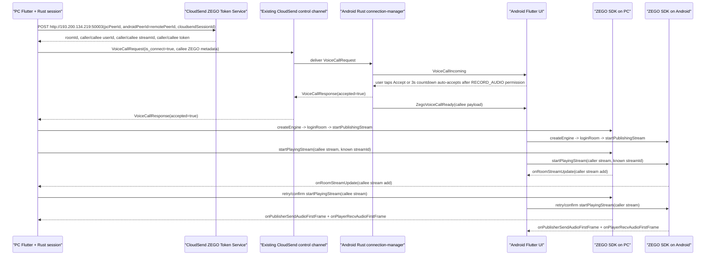
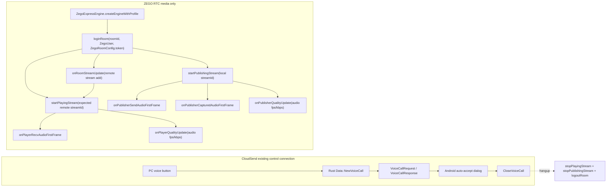
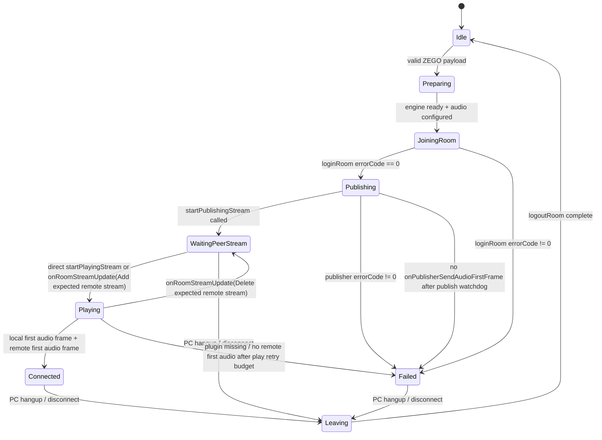

# ZEGO Voice Call Architecture / ZEGO 语音通话工程方案

最后同步源码：2026-06-07

本文是 CloudSend PC -> Android 1v1 ZEGO 语音通话的工程级链路说明。ZEGO 只承载语音媒体，CloudSend 原远控连接只承载邀请、接听、挂断和房间参数分发。

官方依据：

- ZEGO Flutter 实时语音实现音频通话：`https://doc-zh.zego.im/real-time-voice-flutter/quick-start/implementing-voice-call`
- ZEGO Flutter 实时音视频入口：`https://doc-zh.zego.im/real-time-video-flutter/introduction/entry`
- ZEGO `loginRoom`：推流、拉流前必须登录房间；同 AppID 内 `userID` 需要全局唯一。
- ZEGO `onRoomStreamUpdate`：远端开始/停止推流时回调，客户端据此 `startPlayingStream` / `stopPlayingStream`。
- ZEGO `startPublishingStream`：同 AppID 内 `streamID` 必须全局唯一。

## 1. End-to-End Flow

## 2. Media Boundary

CloudSend video, input, ADB/LADB, file transfer, clipboard, terminal, Android `MediaProjection`, `SKL`, `BIS`, `VIDEO_RAW`, and side-button command protocol are outside this media boundary.

## 3. State Truth

UI rule:

- `通话中` only means ZEGO reported both local audio first frame and remote audio first frame.
- `等待对端推流` means local room joined/publish requested, but expected remote stream has not appeared.
- `等待远端音频` means expected remote stream exists and play has started, but remote first audio frame has not arrived.
- `startPlayingStream` is issued with the known expected remote stream id even before `onRoomStreamUpdate` arrives, and then retried. This is a fallback for missed/delayed stream-add callbacks; it does not mark the call connected.
- Missing local or remote first-audio-frame callbacks become visible Chinese failures instead of a fake connected state.
- `onPublisherCapturedAudioFirstFrame` distinguishes "microphone captured" from "stream sent", matching the official ZEGO Flutter demo's publish diagnostics.
- `onPublisherQualityUpdate` and `onPlayerQualityUpdate` expose ongoing audio `fps/kbps` for the Android status card; they are diagnostics only and do not override the first-audio-frame readiness rule.
- No debug toast is allowed for ZEGO internals. User-visible text must be stable Chinese status or concise error text.

## 4. 1v1 Isolation

Room and stream isolation:

- PC obtains ZEGO metadata from the token service per call.
- Current PC endpoint is `http://193.200.134.219:50003`, handled directly by the IP + port token service deployment. It does not use a domain or reverse proxy.
- `cloudsendSessionId = pcPeerId_remotePeerId_reqTimestamp`.
- Token service must create unique `roomId`, `callerUserId`, `calleeUserId`, `callerStreamId`, and `calleeStreamId`.
- PC sends only the Android/callee token to the controlled side; caller token stays in PC memory.

Runtime isolation:

- `src/client/io_loop.rs` no longer rejects by platform string; it attempts ZEGO for the current connected session so Android devices with an unrecognized platform string can still receive the invite.
- `src/client/io_loop.rs` rejects another PC-side ZEGO call while one call owns the current PC process. This avoids Flutter ZEGO singleton callback mixing.
- `src/server/connection.rs` rejects duplicate incoming ZEGO invites on the same controlled Android connection.
- `flutter/lib/models/server_model.dart` rejects a second incoming call while another client already has pending/active ZEGO state or the same client is already in an active ZEGO call, but clears stale local ZEGO state when a new incoming invite is the only current signal.

## 5. Source Anchors

- Protocol: `libs/hbb_common/protos/message.proto::VoiceCallRequest`
- PC token / payload: `src/client/helper.rs::ZegoVoiceCallInfo`
- PC call creation: `src/client/io_loop.rs::Data::NewVoiceCall`
- Android incoming handling: `src/server/connection.rs::handle_voice_call`
- Android Flutter bridge: `src/flutter.rs::zego_voice_call_ready`, `DFm8Y8iMScvB2YDw.kt::DFm8Y8iMScvB2YDwSBN`
- ZEGO SDK state machine: `flutter/lib/models/zego_voice_call_model.dart::ZegoVoiceCallModel`
- PC panel: `flutter/lib/desktop/pages/remote_page.dart::_buildZegoVoiceCallPanel`
- Android status card: `flutter/lib/mobile/pages/server_page.dart::ZegoVoiceCallStatusCard`

## 6. Official Demo Alignment

The official ZEGO Flutter quick-start flow was reviewed as an implementation reference. The demo zip is not a Git-tracked project source file; if a local `ZegoExpressDemo_flutter_dart.zip` is provided again, treat it as external reference material and verify against current ZEGO docs plus CloudSend source anchors.

| Official demo flow | Demo source | CloudSend source |
|---|---|---|
| Create engine with `ZegoEngineProfile` | `lib/topics/QuickStart/quick_start/quick_start_page.dart::createEngine` | `flutter/lib/models/zego_voice_call_model.dart::_ensureEngine` |
| Login room before publish/play | `quick_start_page.dart::loginRoom` | `ZegoVoiceCallModel.join` |
| Use `ZegoRoomConfig.defaultConfig()` and set token | `publish_stream_login_page.dart::_loginRoom` / `play_stream_login_page.dart::_loginRoom` | `ZegoVoiceCallModel.join` |
| Start publishing with unique `streamID` | `publish_stream_publishing_page.dart::onPublishButtonPressed` | `ZegoVoiceCallModel.join` with `publishStreamId` from token service |
| Start playing with remote `streamID` | `play_stream_page.dart::startPlayingStream` | `ZegoVoiceCallModel._startPlayingStream` with `playStreamId` from token service |
| Track publish state | `quick_start_page.dart::setZegoEventCallback` | `ZegoVoiceCallModel._installCallbacks` |
| Track player state | `quick_start_page.dart::setZegoEventCallback` | `ZegoVoiceCallModel._installCallbacks` |
| Track microphone first frame | `publish_stream_publishing_page.dart::onPublisherCapturedAudioFirstFrame` | `ZegoVoiceCallModel._installCallbacks` |
| Track sent audio first frame | `publish_stream_publishing_page.dart::onPublisherSendAudioFirstFrame` | `ZegoVoiceCallModel._installCallbacks` |
| Track publish/play quality | `publish_stream_publishing_page.dart::onPublisherQualityUpdate`, `play_stream_page.dart::onPlayerQualityUpdate` | `ZegoVoiceCallModel._installCallbacks`, PC panel, Android status card |

Intentional CloudSend differences:

- CloudSend uses Token authentication from `docs/ZEGO_TOKEN_SERVICE_DEPLOYMENT.md`; `ZEGO_SERVER_SECRET` stays server-side.
- CloudSend uses `ZegoScenario.StandardVoiceCall` for 1v1 audio instead of the demo's generic/high-quality video scenario.
- CloudSend does not create video canvas views because the module is audio-only; `startPlayingStream(streamID)` is still used for the audio stream.
- CloudSend uses the existing remote-control channel only for invite/accept/hangup and ZEGO room metadata; audio frames never travel through RustDesk `audio_service`.
